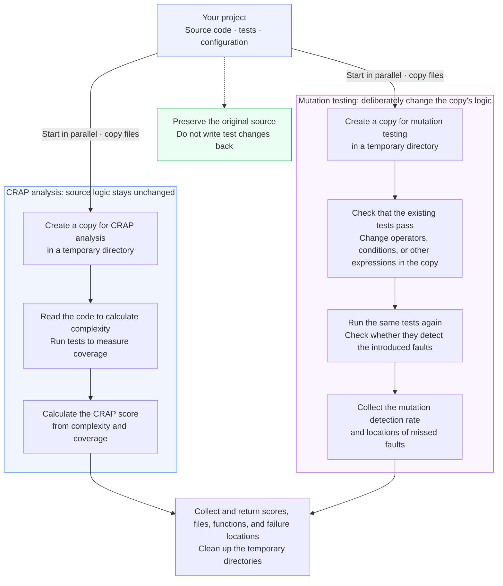
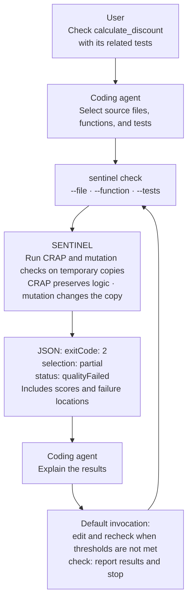

# SENTINEL

[한국어](README.md) | English

[](LICENSE)
[](pyproject.toml)
[](plugins/sentinel/.codex-plugin/plugin.json)
[](pyproject.toml)

**SENTINEL lets coding agents select source files, functions, and tests, then receive scores and failure locations as JSON.** It supports Python, TypeScript, and Java.

By default, the plugin asks the coding agent to **edit code and tests, then recheck until the CRAP and mutation thresholds are met**. Use `check` to measure scores only. A coding agent such as Claude Code or Codex makes the edits; the SENTINEL runner returns the measurements as JSON.


[Features](#features) · [How checks preserve the original source](#how-checks-preserve-the-original-source) · [Technology stack](#technology-stack) · [Getting started](#getting-started) · [Commands for agents](#commands-for-agents) · [Reading JSON results](#reading-json-results) · [Exit codes and status](#exit-codes-and-status) · [Comparison with individual tools](#tools-comparison)

## Features

| Feature | What it tells you |
|---|---|
| CRAP analysis | Evaluates a function's complexity and test coverage without changing the source code's logic. Lower is better; the default maximum is **8**. |
| Mutation testing | Checks whether tests detect **mutants**, which are deliberate changes to operators or values in a temporary copy of the code. The default minimum detection rate is **90%**. |
| Original source preservation | Both checks run tests in project copies created in separate temporary directories. Changes made for testing are not written back to the original source. |
| Scope selection | Select source files, individual functions, and test files. You can also inspect Git changes or the entire configured scope. |
| Locations and evidence | Returns scores by file and function, threshold verdicts, and the locations and statuses of mutants that tests did not detect. |
| JSON output | Uses common fields across all three languages for scope, quality verdicts, and execution errors. |

A quality pass means **the inspected scope meets the CRAP and mutation thresholds**. It does not mean every product requirement is satisfied or that the code has no bugs.

## How checks preserve the original source

SENTINEL **copies the project's source code, tests, and configuration files into the operating system's temporary directory, then runs tests on the copies.** CRAP analysis and mutation testing use those copies differently.

**Checks run in parallel by default.** CRAP and mutation start in separate work directories for the same request, and their results are combined. Add `--execution-mode sequential` to run them one after the other. This option does not run multiple project modules in parallel.

```sh
# Default: run CRAP and mutation in parallel.
sentinel check --file src/pricing.py --tests tests/test_pricing.py
# Choose sequential execution for limited memory or tests that share a database or port.
sentinel check --file src/pricing.py --tests tests/test_pricing.py --execution-mode sequential
```

- **CRAP leaves the source code's logic unchanged.** It reads the code to calculate complexity from constructs such as conditions and loops, then runs tests to measure **coverage**, the code actually executed by those tests. It combines the two measurements into a CRAP score.
- **Mutation testing deliberately changes the copy's logic.** For example, it can replace multiplication with division and run the same tests again. It checks whether the tests miss the introduced fault, measuring their ability to detect faults.



CRAP also runs real tests, which can create measurement reports and build output. Using a copy keeps that work separate from the original project. The diagram shows both checks proceeding normally. If the existing tests fail or required measurements cannot be obtained, SENTINEL reports that problem.

### Where the copies are created

These are **example paths for checking a Python project on Linux with the default parallel mode**. Suffixes such as `abc123` are illustrative; actual temporary directory names are generated at runtime.

```text
Original project
/home/me/shop/
├── src/pricing.py
└── tests/test_pricing.py

CRAP copy: measure without changing source logic
/tmp/sentinel-parallel-abc123/0/sentinel-py-coverage-def456/project/
├── src/pricing.py
└── tests/test_pricing.py

Mutation copy: create and test mutants within this workspace
/tmp/sentinel-parallel-abc123/1/sentinel-py-mutmut-ghi789/project/
├── src/pricing.py
└── tests/test_pricing.py
```

TypeScript and Java also create project copies in the operating system's temporary directory. The actual paths and subdirectory layouts depend on the language and operating system. Temporary directories are cleaned up after the checks.

### Dependencies of the project being checked

External packages used by the project must be prepared before checking it. Installing the checker and preparing project packages are separate steps.

| Language | Preparing and using project packages |
|---|---|
| Python | `setup --python-requirements requirements.txt` prepares `.sentinel-deps`, which is copied into each work directory. An existing `.venv` is not copied or selected automatically. |
| TypeScript | Install the project's packages in the checked module's `node_modules` first. Work directories link to those packages without copying their contents. Vitest, Vite, and mutation tools use the checker's pinned versions. Checks do not install packages automatically. |
| Java | `setup --language java --java-dependencies` prepares `.sentinel-m2`, which both checks reference without copying. If it is absent, the checker's Maven repository is used. Missing packages cause a setup or execution error. |

Parallel execution needs both work copies and their memory at the same time. An execution error stops and cleans up the other running check. A CRAP score or mutation rate below its threshold still collects both results. Changes to the original code during the check are not accepted as a passing result.

**Changes made for testing and edits that improve the project are separate steps.** `check` only reports results. With the default `sentinel` invocation, Claude Code or Codex reads the results and improves the original code and tests. SENTINEL then creates fresh copies of the updated project for the next check.

## From a user request to results



| What the user does | What the coding agent does |
|---|---|
| Identifies the project and the requested task. | Locates source code and tests, then determines the inspection scope. |
| Specifies the environment and languages and requests installation. | Installs the runner and required language tools, then checks the configuration. |
| Chooses the default invocation or the measurement-only `check` skill. | Edits until the thresholds are met for the default invocation, or reports results only for `check`. |

The coding agent selects the related tests. SENTINEL runs the checks on the supplied files using those tests and returns measurements.

## Basis for the defaults

We chose **CRAP ≤ 8 and mutation ≥ 90%** based on 54 runs comparing six target conditions with Prime Agent and DeepSeek. This condition had the shortest average run time among the groups with the highest issue-resolution rate. [CRAP, mutation, and functional issue resolution, by Hwain Hwang (8-page PDF, Korean)](docs/evidence/crap-mutation-function-study.pdf)

## Technology stack

| Component | Technology | Role |
|---|---|---|
| Unified runner | Python 3.9+ | Handles commands, invokes language checkers, and aggregates JSON results. |
| Python | Python AST · coverage.py · mutmut | Analyzes functions, measures coverage, and runs mutation tests. |
| TypeScript | TypeScript Compiler API · Vitest · StrykerJS | Analyzes functions, runs tests, and performs mutation testing. |
| Java | JDK compiler API · Maven · JaCoCo · mutate4java | Analyzes methods, builds code, measures coverage, and runs mutation tests. |
| Agent integration | Claude Code · Codex plugins | Provides instructions for commands, test selection, and result interpretation. |

See the [external tools guide (Korean)](docs/references/sentinel-quality-tools-reference.md) for each tool's role and upstream repository.

## Getting started

### 1. Prepare your environment and install the plugin

Checks run on **Linux, macOS (Intel or Apple Silicon), or Ubuntu on WSL2 for Windows**. The execution environment needs Git, Python 3.9+, and support for Python virtual environments. On Windows, use `wsl --list --verbose` to identify your WSL2 distribution.

Sign in to Claude Code or Codex, then run the commands for your host in a terminal.

```sh
# Claude Code: add the marketplace and install the plugin
claude plugin marketplace add hwain-ai/SENTINEL
claude plugin install sentinel@sentinel
```

```sh
# Codex: add the marketplace and install the plugin
codex plugin marketplace add hwain-ai/SENTINEL
codex plugin add sentinel@sentinel
```

The plugin gives the agent usage instructions. **The actual checker is installed in the next step.** Start a new conversation after installing the plugin. If a command is unavailable, check your host's CLI installation and `plugin --help` first.

### 2. Set up the project

In a new conversation, enter the command for your host. This guide describes plugin version **0.5.0**.

| Claude Code | Codex |
|---|---|
| `/sentinel:start` | `$sentinel:start` |

`start` requests installation and initial configuration. The agent checks the current project, languages, and existing installation, and **asks only for information it cannot determine**. It does not ask again for installation consent already given in the conversation.

The agent installs the runner, runs `setup` for the required languages, checks the source and test configuration, then runs `plan` and `version`. New configurations default to CRAP ≤ 8 and mutation ≥ 90%; existing installations and thresholds are preserved.

Once ready, the agent reports the executable path, languages, and thresholds. `start` finishes after setup and does not start quality checks or code edits. Request those in step 3 below.

On Windows, the agent checks the WSL distribution and project path, for example `Ubuntu` and `/home/me/projects/shop`. Provide the actual path if the agent cannot identify the project from the current conversation.

<details>
<summary>Installing the runner directly, as a user or agent</summary>

These first-time installation commands run inside Linux, macOS, or WSL. If the installation folder already exists, follow the [update instructions](#updating-installed-tools). Install Git, Python, and virtual-environment support with your operating system's package manager if needed.

```sh
# Download the runner source and install it in a dedicated Python environment
mkdir -p "$HOME/.local/share/sentinel"
git clone --depth 1 --config core.autocrlf=false https://github.com/hwain-ai/SENTINEL.git "$HOME/.local/share/sentinel/SENTINEL"
cd "$HOME/.local/share/sentinel/SENTINEL"
python3 -m venv .venv
.venv/bin/python -m pip install .
.venv/bin/sentinel --version
```

The executable is `$HOME/.local/share/sentinel/SENTINEL/.venv/bin/sentinel`. Use that path in subsequent commands. Installing the plugin alone does not add a system-wide `sentinel` command.

</details>

<a id="updating-installed-tools"></a>

### 3. Choose a skill

Use `/sentinel:<name>` in Claude Code or `$sentinel:<name>` in Codex. The full name of the default skill is `/sentinel:sentinel` or `$sentinel:sentinel`.

| Skill | Behavior |
|---|---|
| `sentinel` | Edits code and tests, then rechecks until the existing CRAP and mutation thresholds are met. |
| `check` | Runs the checks and reports scores, locations, and evidence without editing source code or tests. |
| `start` | Installs and configures the tools, then reports readiness. |
| `version` | Checks plugin, runner, and language-tool versions, installation status, and approval status. |
| `update` | Updates the SENTINEL components in use to the latest official release. |

Examples for Claude Code follow. In Codex, replace the leading `/` with `$`.

```text
/sentinel:sentinel Bring calculate_discount in src/pricing.py within the configured thresholds.
/sentinel:sentinel Keep editing until the entire configured scope passes.
/sentinel:check Show only the current scores and failure locations for src/pricing.py.
/sentinel:version
/sentinel:update
```

New configurations default to CRAP ≤ 8 and mutation ≥ 90%. Existing project thresholds take precedence. You can also specify target values in your request to the default skill. The agent must not lower thresholds or exclude targets just to obtain a pass. Even if it narrows the scope during intermediate checks, the final check must cover the originally requested scope.

The `version` skill checks the runner's version number with `sentinel --version` and the project's tool installation with `sentinel version`. Use runner 0.4.0 or later. This skill does not automatically install, update, or run quality checks. `update` applies official releases while preserving project code, tests, and quality thresholds.

## Commands for agents

The examples below use **`sentinel` as shorthand for the installed executable's path**. The agent uses the verified executable and runs it from the project folder. From another directory, add `--project <absolute-project-path>`. Windows agents run these commands inside WSL.

| Purpose | Command | Result |
|---|---|---|
| Initial Python setup | `sentinel setup --language python` | Installs language tools and creates configuration files. |
| Inspect configured targets | `sentinel plan` | Lists configured project modules and languages. |
| Check installation status | `sentinel version` | Checks installation and approval status without running tests. |
| Check a specific function | See the example below. | Returns the selected function's scores and mutant records. |
| Check a whole source file | `sentinel check --file src/pricing.py --tests tests/test_pricing.py` | Checks functions in the selected file. |
| Check Git changes | `sentinel check --changed` | Checks changed source files against `HEAD` by default. |
| Check the entire configured scope | `sentinel check --all` | Checks configured source code with the default test selection. |

```sh
sentinel check --file src/pricing.py --function calculate_discount --tests tests/test_pricing.py
```

| Option | What to provide | When omitted |
|---|---|---|
| `--file` | The source file to score. | Uses the entire configured scope if no other scope option is supplied. |
| `--function` | A function name without `()`, together with exactly one source file. | Checks the whole selected file. |
| `--tests` | A test file to run. | Uses the configured test selection. |

Repeat `--file` or `--tests` to select multiple files. Do not combine `--all`, `--changed`, and `--file`. After changing only tests, recheck using the same `--file` and `--function`. Checks have no automatic time limit by default.

**The entire configured scope means the source code and tests included in the project configuration.** The agent creates the configuration with `setup` and checks it against the actual project. This does not automatically include every file in the repository. Specifying `--tests` also narrows which tests are run.

JSON is the default output format. Add `--format text` for a text summary.

<details>
<summary>Other languages, multiple modules, and test dependencies</summary>

| Situation | Setup |
|---|---|
| TypeScript | `sentinel setup --language typescript` |
| Maven Java | `sentinel setup --language java --java-dependencies` |
| External packages for Python tests | Add `--python-requirements requirements.txt` to `setup`. The path is relative to the Python module. |
| Python in `api/` and TypeScript in `web/` | `sentinel setup --language python --module-root python=api --language typescript --module-root typescript=web` |
| A separate tool storage folder | Use the same `--tools <absolute-path>` with setup, plan, version, and check. |

A module is a project folder checked as a unit. Module roots must be distinct and must not contain one another. If you omit `--language` from `setup`, it selects Python, TypeScript, and Java, so specify only the languages you need. The default tool folder is `.sentinel-tools/` inside the project.

Check project-specific test and build settings after installation. See the [CLI reference (Korean)](docs/references/sentinel-cli-reference.md) for detailed options.

</details>

## Reading JSON results

The following **illustrative example shows tests detecting only one of two mutants in a discount function**. Each fragment keeps only the fields needed for its explanation. `[]` denotes a list of items.

### 1. What was checked, and did it pass?

```json
{
  "schemaVersion": "sentinel-workspace-result-v2",
  "command": "check",
  "exitCode": 2,
  "selection": "partial",
  "moduleCount": 1,
  "results": [
    { "moduleId": "python", "language": "python", "status": "qualityFailed", "exitCode": 2, "admitted": true }
  ]
}
```

The selected Python scope was checked and **did not meet the quality thresholds**. Because the selection is `partial`, this result does not describe the entire project.

| Key | Meaning in this example | How the agent uses it |
|---|---|---|
| `schemaVersion` | The JSON structure version. | Checks whether it understands the result format. |
| `command` | `check`: an actual quality check. | Distinguishes it from `plan` and `version` results. |
| Top-level `exitCode` | `2`: at least one result failed a quality threshold. | Reads the overall command outcome. |
| `selection` | `partial`: selected or changed scope. `allConfigured`: the entire configured scope. | Keeps a partial pass separate from a full-scope pass. |
| `moduleCount` | One module is included in this result. | Counts results across languages and project folders. |
| `results[]` | A list of per-module results. | Identifies failing modules. |
| `moduleId`, `language` | The module name and language from the configuration. | Associates a result with its project folder. |
| Per-module `exitCode`, `status` | The module's exit code and specific status. | Distinguishes quality failures, skipped checks, and execution errors. |
| `admitted` | `true`: the tool is on the approval list. | Identifies approved tools; this is separate from the quality verdict. |
| `details`, `diagnostic` | Measurement details or an execution diagnostic code, when available. | Locates scores and failures or investigates execution problems. |

### 2. Which source files and tests were used?

This is a fragment of `results[].details.scope`.

```json
{
  "files": ["src/pricing.py"],
  "tests": ["tests/test_pricing.py"],
  "testSelection": "explicit"
}
```

`files` lists the source files being scored, and `tests` describes the tests used. `explicit` means test files were selected directly. The agent checks that the actual inspection scope matches the request.

The same `scope` object contains selected function identifiers in `functions`. An empty list means the check was not narrowed to specific functions. When tests are omitted, the tool records its default selection; Java uses `testSelection: "maven"` for Maven test discovery.

### 3. Why did the scores fail the thresholds?

This is a fragment of `results[].details.crap`.

```json
{
  "limit": "8",
  "maxScore": "1",
  "pass": true,
  "functions": [
    { "file": "src/pricing.py", "function": "calculate_discount", "line": 1, "score": "1" }
  ]
}
```

The CRAP score of 1 passes because it is at or below the maximum of 8. Use `functions[]` for individual function scores and `files[].maxScore` for the highest score in each file. **`maxScore` is not an average.**

This is a fragment of `results[].details.mutation`.

```json
{
  "score": "50",
  "minimum": "90",
  "inScope": 2,
  "counts": { "killed": 1, "survived": 1 },
  "pass": false,
  "functions": [
    { "file": "src/pricing.py", "function": "calculate_discount", "score": "50", "killed": 1, "inScope": 2, "pass": false }
  ]
}
```

The tests detected one of two mutants, so **the detection rate is 50%**. This is below the required 90%, so mutation testing failed its threshold. In this example, CRAP passed, but the mutation result makes the module's status `qualityFailed`.

| Key | Meaning and use |
|---|---|
| `score`, `minimum` | The measured detection rate and required minimum. Scores and thresholds are numeric strings. |
| `inScope` | The number of mutants included in the score, not the number of test files or test functions. |
| `counts` | Mutant counts by status. The detection rate is `killed / inScope × 100`. |
| `pass` | Whether the relevant CRAP or mutation threshold was met. There is no top-level command-success boolean. |
| `mutation.functions[]`, `mutation.files[]` | Per-function and per-file `score`, `killed`, `inScope`, `pass`, and `counts`. The agent uses these to locate threshold failures. |

When there are no mutants, `score` is `null`. File and function groups report `pass: null` and `reason: "zeroMutants"`. A check with zero mutants overall is not treated as a pass either.

### 4. Which code change did the tests miss?

This is part of a mutant that was not detected, from `results[].details.mutation.mutants[]`.

```json
{
  "file": "src/pricing.py",
  "function": "calculate_discount",
  "line": 2,
  "original": "price * 0.9",
  "replacement": "price / 0.9",
  "status": "survived"
}
```

The tests still passed after multiplication was changed to division. The agent opens line 2 and the related tests to check **whether they correctly verify the discounted price**. The agent is responsible for determining the cause and making a fix.

| Mutant `status` | Observed fact | What the agent should examine |
|---|---|---|
| `killed` | Tests detected the mutant. | Counts as a successful detection. |
| `survived` | Tests passed despite the code change. | Assertions comparing actual and expected results, and test inputs. |
| `uncovered` | Tests did not execute this location. | Tests that exercise the code. |
| `compileError`, `runtimeError`, `toolError` | A compilation, execution, or tool error occurred. | The cause of the error. These do not count as successful detections. |
| `timedOut`, `pending`, `ignored` | The mutant timed out, is incomplete, or was excluded. | Execution settings and records. These states are not removed from the denominator to raise the score. |

<details>
<summary>Additional measurement fields and setup result keys</summary>

Only fields supplied by the language tool are included. If a location cannot be mapped to a function, the result uses file locations instead of per-function aggregation.

`scope.testSelection` is `explicit` for directly selected tests, `configured` for Python's default selection, and `maven` for Java's default discovery. TypeScript may omit this field; check `scope.tests` for the test files used.

| Location | Key | Meaning |
|---|---|---|
| `details` | `schemaVersion` | The detailed measurement format, `sentinel-diagnostics-v1`. |
| CRAP function | `id`, `sourceRange` | The exact function identifier and source range, distinguishing functions with the same name. |
| CRAP function | `complexity` | The function's control-flow complexity. |
| CRAP function | `coverageBasis`, `coveredUnits`, `totalUnits`, `coverage` | The coverage measurement units and execution coverage. Available fields vary by language. |
| CRAP function | `status` | The score or coverage measurement status, such as `passed` or `coverageUnknown`. |
| CRAP file | `functionCount`, `unknownCount` | The number of functions and the number with unknown scores. |
| Mutant | `id`, `callableId` | The mutant identifier and its associated function identifier. |
| Mutant | `file`, `function`, `line`, `column`, `location`, `sourceStartByte` | File, function, line, column, or byte location in the source. |
| Mutant | `original`, `replacement` | The original expression and its replacement. |

`setup` uses `sentinel-setup-result-v2`, which differs from the check result format. Setup results do not contain `selection`.

| Setup result key | Meaning |
|---|---|
| `command`, `exitCode` | The `setup` command and its exit outcome. |
| `gate.crapMax`, `gate.mutationMin` | The saved CRAP maximum and minimum mutation detection rate. |
| `results[].language`, `status` | Per-language installation status. Success is `installed`. |
| `results[].toolVersion`, `toolDigest` | The installed tool's version and file fingerprint. |
| `workspaceConfig` | The workspace configuration path written, or `null` on failure. |
| `projectConfig` | `created` for a new source/test configuration, `kept` for an existing one, or `null` when not applicable. |

</details>

**The entire JSON document, including its `exitCode` field, is written to stdout (standard output).** The process also returns an exit code separately. Errors before JSON is generated, such as invalid input, may produce only stderr (standard error) and a process exit code.

## Exit codes and status

The agent reads `exitCode` for the command outcome and `results[].status` for each module's status.

| Exit code | Typical `status` | Meaning and next action |
|---|---|---|
| `0` | `passed` | The inspected scope passed the quality thresholds. |
| `0` | `noChanges` | Skipped because there was no changed source code to inspect. Use `--file` or `--all` when needed. |
| `0` | `planned`, `ready`, `installed` | Scope inspected, installation checked, or installation completed, respectively. These are not quality checks. |
| `1` | `toolError` | Tool execution failed. Check the diagnostic. |
| `2` | `qualityFailed` | Scores did not meet the thresholds. Inspect CRAP and mutation details. |
| `3` | `usageConfigError` | Input or configuration problem. Check paths and options. The command may exit without JSON. |
| `4` | `baselineFailed` | The original tests failed before mutants were created. Fix the original test failures first. |
| `5` | `dependencyError` | Installation or dependency problem. Check `setup` and project dependencies. |
| `6` | `backendError`, `backendNotAdmitted` | A checker integration error or an unapproved tool. Check the diagnostic and installed version. |
| `7` | `evidenceError` | Measurement evidence required for a verdict is invalid. Do not treat the result as a pass until the evidence is verified. |
| `8` | `cancelled` | The check was cancelled. Rerun the required scope. |

Do not infer a quality pass from `exitCode: 0` alone. Check `selection` and every module's `status`. For example, `partial + passed` is a partial pass, while `allConfigured + all results passed` means the entire configured scope passed. A development run using `--experimental` returns exit code 6 even when all quality results are `passed`.

<a id="tools-comparison"></a>

## SENTINEL and individual tools

SENTINEL uses StrykerJS for TypeScript, mutmut for Python, and mutate4java for Java. It combines their mutation results with CRAP scores and common verdict and scope information.

The underlying tools also support selection and result inspection. [StrykerJS provides JSON reports and file/line selection](https://stryker-mutator.io/docs/stryker-js/configuration/), [mutmut supports function-level execution and result browsing](https://github.com/boxed/mutmut), and [mutate4java supports file/line selection](https://github.com/unclebob/mutate4java).

| Agent task | Integrating tools directly | Using SENTINEL |
|---|---|---|
| Run checks | Use each tool's commands and configuration. | Request checks with `check --file --function --tests`. |
| Inspect complexity and test quality together | Connect CRAP calculations and mutation results separately. | Read `details.crap` and `details.mutation` together. |
| Locate failures | Interpret each tool's output and reports. | Access common `files`, `functions`, and `mutants` fields. |
| Distinguish full, partial, and skipped checks | Track scope and results for each run separately. | Check `selection`, `scope`, and `status`. |
| Automate across three languages | Write tool-specific result parsing and error handling. | Use common exit codes and JSON fields. |

For example, an agent can locate functions with `mutation.functions[].pass == false`, inspect the associated `mutants`, and strengthen the relevant tests. The JSON alone does not establish which test is deficient.

SENTINEL's rules for counting detections and errors can produce scores different from those of the underlying tools. We do not claim that SENTINEL runs faster or finds more defects. See [result interpretation (Korean)](docs/results.md) for the calculation rules.

## Related documentation

The usage and contributor guides linked below are currently in Korean.

- [Documentation index](docs/index.md): document summaries and related code.
- [Result interpretation](docs/results.md): measurement examples and score calculations.
- [CLI reference](docs/references/sentinel-cli-reference.md): options, configuration, and tool integration contracts.
- [Plugin guide](plugins/sentinel/README.md): instructions for Claude Code and Codex.
- [Contributing (Korean)](docs/contributing.md): report problems and submit documentation or code changes.
- [Development guide (Korean)](docs/development.md): development setup, tests, and documentation checks.
- [MIT license](LICENSE)
