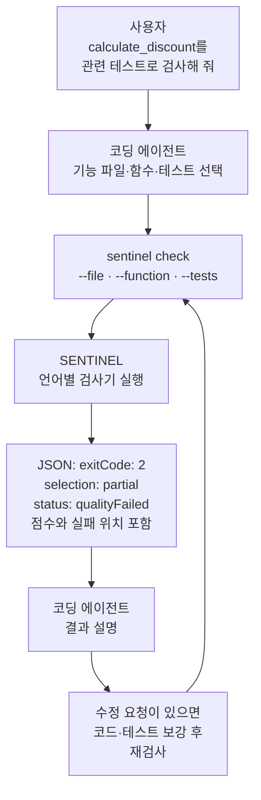

# SENTINEL

[](LICENSE)
[](pyproject.toml)
[](pyproject.toml)

**코딩 에이전트가 파일·함수와 테스트를 골라 검사하고, 점수와 실패 위치를 JSON으로 받는 도구입니다.** Python·TypeScript·Java를 지원합니다.

사용자는 Claude Code·Codex에 검사를 요청합니다. 에이전트는 SENTINEL을 실행하고, 반환된 CRAP·mutation 결과를 보고 코드나 테스트를 수정합니다. SENTINEL 자체에는 LLM이 없습니다.


[주요 기능](#주요-기능) · [기술 스택](#기술-스택) · [사용 가이드](#사용-가이드) · [실행 명령](#에이전트가-실행하는-명령) · [JSON 읽기](#json-결과-읽기) · [종료 코드·상태](#종료-코드와-status) · [기존 도구와 비교](#tools-comparison)

## 주요 기능

| 기능 | 확인할 수 있는 내용 |
|---|---|
| CRAP 검사 | 함수의 복잡도와 테스트가 실행한 코드 범위를 함께 평가합니다. 낮을수록 좋으며 기본 상한은 **8**입니다. |
| Mutation 검사 | 연산자나 값을 일부러 바꾼 코드인 **변이**를 테스트가 발견하는지 확인합니다. 기본 최소 탐지율은 **90%**입니다. |
| 범위 선택 | 기능 파일, 특정 함수, 실행할 테스트를 지정합니다. Git 변경분이나 설정된 전체 범위도 검사합니다. |
| 위치와 근거 | 파일·함수별 점수, 기준 미달 여부, 발견하지 못한 변이의 위치와 상태를 반환합니다. |
| 공통 JSON | 세 언어에서 같은 필드로 검사 범위·품질 판정·실행 오류를 읽습니다. |

품질 통과는 **검사한 범위가 CRAP·mutation 기준을 충족했다는 뜻**입니다. 제품의 모든 요구사항 충족이나 모든 버그의 부재를 뜻하지 않습니다.

## 사용자 입력부터 결과까지



| 사용자에게 필요한 일 | 코딩 에이전트가 하는 일 |
|---|---|
| 검사할 프로젝트와 원하는 작업을 알려 줍니다. | 소스·테스트 위치를 찾아 검사 범위를 정합니다. |
| 설치할 환경과 언어를 알려 주고 설치를 요청합니다. | 실행기와 필요한 언어 도구를 설치하고 설정을 확인합니다. |
| 검사만 할지, 수정까지 할지 정합니다. | 요청한 범위에서 검사·수정·재검사를 실행하고 결과를 설명합니다. |

관련 테스트를 고르는 주체는 코딩 에이전트입니다. SENTINEL은 전달받은 파일과 테스트를 실행하고 측정값을 돌려줍니다.

## 기술 스택

| 구성 | 사용 기술 | 역할 |
|---|---|---|
| 통합 실행기 | Python 3.9+ | 명령 처리, 언어 검사기 호출, JSON 결과 집계 |
| Python | Python AST · coverage.py · mutmut | 함수 분석, 커버리지 측정, 변이 검사 |
| TypeScript | TypeScript Compiler API · Vitest · StrykerJS | 함수 분석, 테스트 실행, 변이 검사 |
| Java | JDK compiler API · Maven · JaCoCo · mutate4java | 메서드 분석, 빌드·커버리지 측정, 변이 검사 |
| 에이전트 연동 | Claude Code · Codex 플러그인 | 에이전트에 명령·테스트 선택·결과 해석 지침 제공 |

각 도구의 역할과 원본 저장소는 [외부 도구 안내](docs/references/sentinel-quality-tools-reference.md)에 있습니다.

## 사용 가이드

### 1. 사용할 환경과 플러그인 준비

실제 검사는 **Linux 또는 Windows의 WSL2 Ubuntu**에서 실행합니다. macOS의 통합 실행기 설치는 현재 지원하지 않습니다. Linux 쪽에는 Git, Python 3.9+와 가상환경 생성 기능이 필요합니다. Windows에서는 `wsl --list --verbose`로 WSL2 배포판을 확인하세요.

Claude Code·Codex에 로그인한 뒤, 사용하는 도구의 명령만 터미널에서 실행합니다.

```sh
# Claude Code: 설치 목록 등록 후 플러그인 설치
claude plugin marketplace add hwain-ai/SENTINEL
claude plugin install sentinel@sentinel
```

```sh
# Codex: 설치 목록 등록 후 플러그인 설치
codex plugin marketplace add hwain-ai/SENTINEL
codex plugin add sentinel@sentinel
```

플러그인은 에이전트에게 사용법을 알려 줍니다. **실제 검사 프로그램은 다음 단계에서 설치합니다.** 플러그인 설치 후 새 대화를 열어 주세요. 명령을 찾지 못하면 해당 도구의 CLI 설치와 `plugin --help`를 먼저 확인합니다.

### 2. 에이전트에게 설치 요청

아래 프롬프트의 `<...>`만 실제 값으로 바꿔 Claude Code·Codex에 보내세요. 실행기 설치부터 첫 검사까지 요청하는 프롬프트입니다.

```text
https://github.com/hwain-ai/SENTINEL 의 README를 읽고 SENTINEL을 설치해 줘.

- 실행 환경: <Linux 또는 WSL2 배포판 이름>
- 검사할 프로젝트 절대 경로: <프로젝트 경로>
- 사용할 언어: <python / typescript / java 중 필요한 언어>

공식 저장소의 실행기를 설치하고, setup으로 필요한 언어 도구를 준비해 줘.
여러 언어가 있으면 실제 폴더를 찾아 언어별 검사 폴더를 지정해 줘.
소스·테스트 폴더와 테스트 의존성을 확인하고 프로젝트 설정에 맞춰 줘.
기준은 CRAP 8 이하, mutation 90% 이상으로 설정해 줘.
plan과 doctor로 준비 상태를 확인한 뒤 첫 검사를 실행해 줘.
실행기·프로젝트 경로, 검사한 범위와 결과를 알려 줘. 코드 수정은 하지 마.
```

입력 예: `실행 환경: WSL2 Ubuntu / 프로젝트 경로: /home/me/projects/shop / 사용할 언어: python`.

이 가이드의 Windows 설치 예시는 WSL 내부 프로젝트를 기준으로 합니다. 프로젝트가 `C:\...`에 있다면 설치 전에 에이전트에게 WSL에서 사용할 경로와 검사 가능 여부를 먼저 확인해 달라고 요청하세요.

에이전트는 실행기 설치 → `setup` → 소스·테스트 설정 확인 → `plan` → `doctor` → `check` 순서로 작업합니다. 새 설정을 만들면 `sentinel.workspace.json`에 검사할 프로젝트 폴더와 언어 도구를 기록합니다. Python·TypeScript의 `sentinel.config.json`에는 소스·테스트 범위를 기록합니다.

<details>
<summary>에이전트 또는 사용자가 직접 실행기를 설치할 때</summary>

아래는 Ubuntu/Linux에서 처음 설치하는 명령입니다. 설치 폴더가 이미 있으면 [갱신 안내](#승인된-도구-버전-갱신)를 따릅니다. Git·Python·가상환경 기능이 없으면 먼저 운영체제의 패키지 관리자로 준비합니다.

```sh
# 실행기 소스를 받아 전용 Python 환경에 설치
mkdir -p "$HOME/.local/share/sentinel"
git clone --depth 1 --config core.autocrlf=false https://github.com/hwain-ai/SENTINEL.git "$HOME/.local/share/sentinel/SENTINEL"
cd "$HOME/.local/share/sentinel/SENTINEL"
python3 -m venv .venv
.venv/bin/python -m pip install .
.venv/bin/sentinel --version
```

실행 파일은 `$HOME/.local/share/sentinel/SENTINEL/.venv/bin/sentinel`입니다. 이후 명령에서 이 경로를 사용합니다. 플러그인 설치만으로 `sentinel` 명령이 시스템에 등록되지는 않습니다.

</details>

### 3. 에이전트에게 검사 요청

설치를 마친 대화에서는 원하는 작업을 그대로 요청합니다.

```text
SENTINEL로 src/pricing.py의 calculate_discount 함수를 검사해 줘.
관련 테스트를 찾아 사용하고, CRAP·mutation 점수와 기준 미달 위치를 알려 줘.
```

수정과 재검사까지 원한다면 다음처럼 요청합니다.

```text
SENTINEL로 변경한 기능 코드를 검사해 줘.
기준에 미달하면 요구사항에 맞게 코드나 테스트를 고치고 다시 검사해 줘.
마지막에는 설정된 전체 범위를 검사하고, 부분 검사와 전체 검사 결과를 구분해 줘.
```

새 대화에서는 설치 때 확인한 실행기와 프로젝트의 절대 경로도 알려 주세요. 별도 도구 폴더를 썼다면 그 경로도 필요합니다.

## 에이전트가 실행하는 명령

아래 `sentinel`은 **설치된 실행 파일 경로를 줄여 쓴 표기**입니다. 에이전트는 확인한 실행 파일을 사용하고 검사할 프로젝트 폴더에서 실행합니다. 다른 폴더에서는 `--project <프로젝트 절대 경로>`를 붙입니다. Windows 에이전트는 이 명령을 WSL 안에서 실행합니다.

| 목적 | 명령 | 결과 |
|---|---|---|
| Python 프로젝트 최초 설정 | `sentinel setup --language python` | 언어 도구 설치와 설정 파일 생성 |
| 검사 대상 확인 | `sentinel plan` | 설정된 프로젝트 폴더와 언어 목록 |
| 설치 상태 확인 | `sentinel doctor` | 도구 설치·승인 상태. 테스트는 실행하지 않음 |
| 특정 함수 검사 | 아래 명령 참고 | 선택한 함수의 점수와 변이 기록 |
| 특정 파일 전체 검사 | `sentinel check --file src/pricing.py --tests tests/test_pricing.py` | 해당 파일 안의 함수들 검사 |
| Git 변경분 검사 | `sentinel check --changed` | 기본 `HEAD` 기준 변경된 기능 코드 검사 |
| 설정된 전체 범위 검사 | `sentinel check --all` | 설정된 기능 코드와 기본 테스트 묶음 검사 |

```sh
sentinel check --file src/pricing.py --function calculate_discount --tests tests/test_pricing.py
```

| 옵션 | 입력하는 것 | 생략하면 |
|---|---|---|
| `--file` | 점수를 측정할 기능 파일 | 별도 범위 옵션이 없으면 설정된 전체 범위 |
| `--function` | 함수 이름. `()` 없이 입력하며 파일 하나와 함께 사용 | 선택한 파일 전체 |
| `--tests` | 실행할 테스트 파일 | 설정된 테스트 묶음 |

여러 파일·테스트는 `--file`·`--tests`를 반복합니다. `--all`·`--changed`·`--file`은 함께 쓰지 않습니다. 테스트만 수정했어도 같은 `--file`·`--function`으로 재검사합니다. 기본 자동 검사 시간 제한은 없습니다.

**전체 범위는 프로젝트 설정에 포함된 기능 코드와 테스트입니다.** 에이전트가 `setup`으로 설정을 만들고 실제 프로젝트에 맞게 확인합니다. 저장소의 모든 파일을 무조건 검사한다는 뜻은 아닙니다. `--tests`를 따로 지정하면 실행할 테스트도 그 범위로 좁아집니다.

출력은 기본적으로 JSON입니다. 텍스트 요약이 필요하면 `--format text`를 붙입니다.

<details>
<summary>다른 언어·여러 모듈·의존 패키지 설정</summary>

| 상황 | 설정 방법 |
|---|---|
| TypeScript | `sentinel setup --language typescript` |
| Maven Java | `sentinel setup --language java --java-dependencies` |
| Python 테스트의 외부 패키지 | `setup`에 `--python-requirements requirements.txt` 추가. 해당 Python 모듈 기준 경로 |
| Python `api/`와 TypeScript `web/` | `sentinel setup --language python --module-root python=api --language typescript --module-root typescript=web` |
| 별도 도구 보관 폴더 | `--tools <절대 경로>`를 setup·plan·doctor·check에서 동일하게 사용 |

모듈은 따로 검사할 프로젝트 폴더입니다. 여러 모듈의 폴더는 같거나 서로 포함 관계일 수 없습니다. `setup`에서 언어를 생략하면 Python·TypeScript·Java를 모두 선택하므로 필요한 언어를 명시합니다. `--tools` 기본값은 프로젝트의 `.sentinel-tools/`입니다.

프로젝트별 테스트·빌드 설정은 설치 후 확인해야 합니다. 상세 옵션은 [CLI 참고](docs/references/sentinel-cli-reference.md)에 있습니다.

</details>

## JSON 결과 읽기

아래는 **할인 함수의 변이 2개 중 1개만 테스트가 발견한 설명용 예시**입니다. 실제 출력에서 필요한 필드만 남긴 형식으로, 각 조각을 따로 설명합니다. `[]`는 여러 항목이 들어가는 목록입니다.

### 1. 무엇을 검사했고 통과했는가

```json
{
  "schemaVersion": "sentinel-workspace-result-v2",
  "command": "check",
  "exitCode": 2,
  "selection": "partial",
  "moduleCount": 1,
  "results": [
    { "moduleId": "python", "language": "python", "status": "qualityFailed", "exitCode": 2, "admitted": true }
  ]
}
```

선택한 Python 범위를 검사했고 **품질 기준에 미달했습니다.** `partial`이므로 프로젝트 전체의 결과로 해석하지 않습니다.

| 키 | 예시 값의 뜻 | 에이전트가 사용하는 곳 |
|---|---|---|
| `schemaVersion` | JSON 구조의 버전 | 읽을 수 있는 결과 형식인지 확인 |
| `command` | `check`: 실제 검사 명령 | `plan`·`doctor` 결과와 구분 |
| 최상위 `exitCode` | `2`: 하나 이상의 검사 결과가 품질 기준 미달 | 명령 전체 종료 결과 확인 |
| `selection` | `partial`: 선택·변경분 검사. `allConfigured`: 설정된 전체 범위 | 부분 통과를 전체 통과로 보고하지 않도록 확인 |
| `moduleCount` | 결과에 포함된 모듈 1개. 모듈은 따로 검사하는 프로젝트 폴더 | 여러 언어·프로젝트 폴더의 결과 개수 확인 |
| `results[]` | 모듈별 결과 목록 | 실패한 모듈부터 확인 |
| `moduleId`, `language` | 설정의 모듈 이름과 언어 | 어느 프로젝트 폴더의 결과인지 연결 |
| 모듈의 `exitCode`, `status` | 해당 모듈의 종료 코드와 구체적 상태 | 품질 미달·미검사·실행 오류 구분 |
| `admitted` | `true`: 승인 목록에 있는 도구 | 사용한 도구 확인. 품질 합격 여부와는 별개 |
| `details`, `diagnostic` | 측정 상세, 또는 실행 문제의 진단 코드. 제공될 때 포함 | 점수·위치 확인 또는 실행 문제 해결 |

### 2. 어느 파일과 테스트를 사용했는가

`results[].details.scope`의 일부입니다.

```json
{
  "files": ["src/pricing.py"],
  "tests": ["tests/test_pricing.py"],
  "testSelection": "explicit"
}
```

`files`는 점수를 측정한 기능 파일, `tests`는 실행에 사용한 테스트 범위입니다. `explicit`은 테스트를 직접 지정했다는 뜻입니다. 에이전트는 요청한 대상과 실제 검사 범위가 같은지 확인합니다.

같은 `scope`의 `functions`에는 선택한 함수 식별자가 들어갑니다. 빈 목록이면 특정 함수로 좁히지 않은 검사입니다. 테스트를 생략하면 도구가 사용한 기본 범위를 기록하며, Java는 `testSelection: "maven"`으로 Maven의 테스트 탐색을 표시합니다.

### 3. 점수가 왜 기준에 미달했는가

`results[].details.crap`의 일부입니다.

```json
{
  "limit": "8",
  "maxScore": "1",
  "pass": true,
  "functions": [
    { "file": "src/pricing.py", "function": "calculate_discount", "line": 1, "score": "1" }
  ]
}
```

CRAP 점수 1은 상한 8 이하이므로 통과했습니다. `functions[]`로 각 함수의 점수를 확인하고, `files[].maxScore`로 파일에서 가장 높은 점수를 확인합니다. **`maxScore`는 평균이 아닙니다.**

`results[].details.mutation`의 일부입니다.

```json
{
  "score": "50",
  "minimum": "90",
  "inScope": 2,
  "counts": { "killed": 1, "survived": 1 },
  "pass": false,
  "functions": [
    { "file": "src/pricing.py", "function": "calculate_discount", "score": "50", "killed": 1, "inScope": 2, "pass": false }
  ]
}
```

테스트가 변이 2개 중 1개를 발견해 **탐지율은 50%**입니다. 최소 90%에 못 미쳐 mutation은 실패했습니다. 이 예시는 CRAP은 통과했지만 mutation 때문에 모듈 결과가 `qualityFailed`입니다.

| 키 | 뜻과 사용법 |
|---|---|
| `score`, `minimum` | 실제 탐지율과 요구하는 최소 탐지율. 점수·기준은 숫자 문자열로 제공 |
| `inScope` | 점수 계산 대상 변이 수. 테스트 파일·테스트 함수의 개수가 아님 |
| `counts` | 상태별 변이 개수. `killed / inScope × 100`으로 탐지율 계산 |
| `pass` | 해당 CRAP·mutation 기준 충족 여부. 최상위 명령 성공 불리언은 없음 |
| `mutation.functions[]`, `mutation.files[]` | 함수별·파일별 `score`, `killed`, `inScope`, `pass`, `counts`. 에이전트가 기준 미달 위치를 좁히는 데 사용 |

변이가 없으면 `score`는 `null`입니다. 파일·함수 그룹은 `pass: null`, `reason: "zeroMutants"`를 표시합니다. 전체 변이가 0개인 검사도 통과로 처리하지 않습니다.

### 4. 어떤 코드 변화를 테스트가 놓쳤는가

`results[].details.mutation.mutants[]`에서 발견하지 못한 변이 하나의 일부입니다.

```json
{
  "file": "src/pricing.py",
  "function": "calculate_discount",
  "line": 2,
  "original": "price * 0.9",
  "replacement": "price / 0.9",
  "status": "survived"
}
```

곱셈을 나눗셈으로 바꿨는데도 테스트가 통과했습니다. 에이전트는 2번째 줄과 관련 테스트를 열어 **할인 결과를 올바르게 확인하는지** 검토합니다. 원인을 확정하거나 수정안을 만드는 일은 에이전트가 담당합니다.

| 변이의 `status` | 측정된 사실 | 에이전트의 확인 대상 |
|---|---|---|
| `killed` | 테스트가 변이를 발견함 | 탐지 성공으로 계산 |
| `survived` | 코드를 바꿔도 테스트가 통과함 | 실제 결과와 기대 결과를 비교하는 검사, 테스트 입력 사례 |
| `uncovered` | 테스트가 해당 위치를 실행하지 않음 | 그 코드를 실행하는 테스트 |
| `compileError`, `runtimeError`, `toolError` | 컴파일·실행·도구 오류 | 오류 원인. 탐지 성공으로 합산하지 않음 |
| `timedOut`, `pending`, `ignored` | 시간 초과·미완료·제외 상태 | 실행 설정과 기록. 분모에서 빼서 점수를 높이지 않음 |

<details>
<summary>추가 측정 필드와 설치 결과 키</summary>

언어 도구가 제공한 필드만 포함합니다. 위치를 함수에 연결할 수 없으면 함수별 집계 대신 파일 위치를 사용합니다.

`scope.testSelection`은 테스트를 직접 선택하면 `explicit`, Python의 기본 테스트 범위는 `configured`, Java의 기본 탐색은 `maven`입니다. TypeScript에서는 이 필드가 생략될 수 있으므로 `scope.tests`로 사용한 테스트 파일을 확인합니다.

| 위치 | 키 | 뜻 |
|---|---|---|
| `details` | `schemaVersion` | 측정 상세 형식 `sentinel-diagnostics-v1` |
| CRAP 함수 | `id`, `sourceRange` | 정확한 함수 식별자와 소스 범위. 동명이인 함수를 구분 |
| CRAP 함수 | `complexity` | 함수의 제어 흐름 복잡도 |
| CRAP 함수 | `coverageBasis`, `coveredUnits`, `totalUnits`, `coverage` | 커버리지 측정 단위와 실행 범위. 언어에 따라 제공 필드가 다름 |
| CRAP 함수 | `status` | 점수·커버리지 측정 상태. 예: `passed`, `coverageUnknown` |
| CRAP 파일 | `functionCount`, `unknownCount` | 함수 개수와 점수를 알 수 없는 함수 개수 |
| 변이 | `id`, `callableId` | 변이와 연결된 함수의 식별자 |
| 변이 | `file`, `function`, `line`, `column`, `location`, `sourceStartByte` | 파일·함수·행·열 또는 소스 바이트 위치 |
| 변이 | `original`, `replacement` | 원본 표현식과 바꾼 표현식 |

`setup`은 검사 결과와 다른 `sentinel-setup-result-v2` 형식입니다. 설치 결과에는 `selection`이 없습니다.

| 설치 결과 키 | 뜻 |
|---|---|
| `command`, `exitCode` | `setup` 명령과 종료 결과 |
| `gate.crapMax`, `gate.mutationMin` | 저장한 CRAP 상한과 최소 변이 탐지율 |
| `results[].language`, `status` | 언어별 설치 상태. 성공은 `installed` |
| `results[].toolVersion`, `toolDigest` | 설치한 도구의 버전과 파일 지문 |
| `workspaceConfig` | 작성한 workspace 설정 경로. 실패하면 `null` |
| `projectConfig` | 소스·테스트 설정을 새로 만들면 `created`, 유지하면 `kept`, 해당 사항 없으면 `null` |

</details>

JSON 안의 `exitCode`를 포함한 **JSON 전체가 stdout(표준 출력)**입니다. 프로세스 종료 코드도 별도로 전달합니다. JSON 생성 전 입력 오류 등은 stderr(표준 오류)와 종료 코드만 나올 수 있습니다.

## 종료 코드와 status

에이전트는 `exitCode`로 명령 종료 결과를 읽고, `results[].status`로 모듈별 상태를 확인합니다.

| 종료 코드 | 대표 `status` | 의미와 다음 행동 |
|---|---|---|
| `0` | `passed` | 실제 검사 범위가 품질 기준을 통과 |
| `0` | `noChanges` | 검사할 변경 기능 코드가 없어 건너뜀. 필요하면 `--file` 또는 `--all`로 실행 |
| `0` | `planned`, `ready`, `installed` | 각각 범위 확인·설치 확인·설치 완료. 품질 검사는 아직 아님 |
| `1` | `toolError` | 도구 실행 실패. 진단 확인 |
| `2` | `qualityFailed` | 점수가 기준 미달. CRAP·mutation 상세 확인 |
| `3` | `usageConfigError` | 입력·설정 문제. 경로와 옵션 확인. JSON 없이 종료될 수도 있음 |
| `4` | `baselineFailed` | 변이를 만들기 전 원래 테스트부터 실패. 원래 테스트 우선 수정 |
| `5` | `dependencyError` | 설치·의존성 문제. `setup`과 프로젝트 의존성 확인 |
| `6` | `backendError`, `backendNotAdmitted` | 검사기 연결 오류 또는 미승인 도구. 진단·설치 버전 확인 |
| `7` | `evidenceError` | 판정에 필요한 측정 근거가 유효하지 않음. 근거 확인 전 통과로 처리하지 않음 |
| `8` | `cancelled` | 검사 취소. 필요한 범위로 다시 실행 |

`exitCode: 0`만으로 품질 통과를 판단하지 않습니다. `selection`과 모든 모듈의 `status`를 함께 확인합니다. 예를 들어 `partial + passed`는 부분 통과, `allConfigured + 모든 결과 passed`는 설정된 전체 범위 통과입니다. 개발용 `--experimental` 검사는 모두 `passed`여도 종료 코드 6을 반환합니다.

<a id="tools-comparison"></a>

## Stryker·mutmut·mutate4java와 함께 쓰는 이유

SENTINEL은 TypeScript에 StrykerJS, Python에 mutmut, Java에 mutate4java를 사용합니다. 이 도구들이 만든 변이 결과에 CRAP 점수와 공통 판정·범위 정보를 붙여 반환합니다.

원본 도구에도 선택·결과 확인 기능이 있습니다. [StrykerJS는 JSON 보고서와 파일·행 범위 선택](https://stryker-mutator.io/docs/stryker-js/configuration/)을, [mutmut은 함수별 실행과 결과 탐색](https://github.com/boxed/mutmut)을, [mutate4java는 파일·행 선택](https://github.com/unclebob/mutate4java)을 제공합니다.

| 에이전트가 해야 할 일 | 언어 도구를 직접 연결할 때 | SENTINEL을 사용할 때 |
|---|---|---|
| 검사 실행 | 도구별 명령·설정에 맞춰 호출 | `check --file --function --tests`로 요청 |
| 복잡도와 테스트 품질 함께 확인 | CRAP 계산과 변이 결과를 별도로 연결 | `details.crap`과 `details.mutation`을 함께 읽음 |
| 실패 위치 찾기 | 각 도구의 출력·보고서를 해석 | `files`, `functions`, `mutants`의 공통 필드로 접근 |
| 전체·부분·미검사 구분 | 각 실행의 범위와 결과를 따로 관리 | `selection`, `scope`, `status`로 확인 |
| 세 언어의 자동 처리 | 도구마다 결과 해석·오류 분기 작성 | 공통 종료 코드와 JSON 필드를 사용 |

예를 들어 에이전트는 `mutation.functions[].pass == false`인 함수를 찾고, 같은 함수의 `mutants`에서 놓친 변이를 확인한 뒤 해당 테스트를 보강할 수 있습니다. JSON만으로 특정 테스트가 부족하다고 자동 확정하지는 않습니다.

SENTINEL의 탐지 성공·오류 계산 규칙 때문에 원본 도구와 점수가 다를 수 있습니다. 더 빠르거나 더 많은 결함을 찾는다는 비교 성능을 주장하지 않습니다. 계산 기준은 [결과 해석](docs/results.md)을 참고하세요.

## 승인된 도구 버전 갱신

플러그인·실행기·언어 도구는 별도로 갱신합니다. `setup`은 이미 받은 언어 소스를 자동으로 갱신하지 않습니다. 에이전트에게 현재 설치 경로와 함께 다음처럼 요청하세요.

```text
현재 SENTINEL 실행기와 필요한 언어 도구를 공식 저장소 기준으로 갱신해 줘.
기존 소스의 미커밋 변경을 보존하고, 언어 도구는 새 소스 폴더에서 setup으로 준비해 줘.
기존 프로젝트·도구 경로와 의존성 설정을 유지해 줘.
doctor로 승인 상태를 확인하고 동일한 범위를 재검사해 줘.
```

파일·함수 선택에는 Python·TypeScript 어댑터 `0.1.3`, Java 어댑터 `0.1.4`를 사용합니다. 승인된 버전은 [승인 목록](src/sentinel/admission.json)에서 확인합니다.

## 관련 문서

- [문서 색인](docs/index.md): 문서별 내용과 연결된 코드
- [결과 해석](docs/results.md): 측정 사례와 점수 계산
- [CLI 참고](docs/references/sentinel-cli-reference.md): 옵션·설정·도구 연결 계약
- [플러그인 안내](plugins/sentinel/README.md): Claude Code·Codex 사용 지침
- [개발·문서 관리](docs/contributing.md): 수정한 코드에 맞는 문서와 push 전 검사
- [MIT 라이선스](LICENSE)
