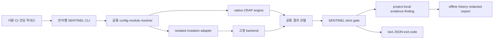

# SENTINEL 다언어 품질 게이트 설계

이 설계는 Python·TypeScript·Go·Java·Clojure 프로젝트를 같은 기준으로 검사해 CRAP은 8.0 이하, mutation은 검사 대상 mutant 전부가 `killed`일 때만 합격시키고 그 근거를 프로젝트 안에 남긴다.

## 이 문서를 읽기 전에

### 먼저 알아둘 말

|용어|이 문서에서 뜻하는 것|
|---|---|
|품질 게이트(quality gate)|정해 둔 기준을 모두 만족해야 다음 단계로 진행시키는 검사|
|Production source|실제 제품 동작을 만드는 코드. Test code와 구분함|
|Test coverage|Production source 중 test가 실제로 실행한 범위의 비율|
|Callable|함수·method·lambda처럼 이름을 붙이거나 호출할 수 있는 코드 단위|
|Cyclomatic complexity(CC)|분기·반복처럼 실행 경로를 늘리는 구조를 세어 나타낸 복잡도|
|CRAP(Change Risk Anti-Patterns)|코드의 분기 복잡도와 test coverage를 함께 계산한 위험 점수. 이 설계에서는 함수 같은 검사 단위마다 8.0 이하를 요구함|
|Mutation test|production code를 일부러 조금 바꾼 뒤 test가 그 변화를 발견하는지 확인하는 검사|
|Mutant|mutation test가 일부러 변경한 코드 한 건|
|`killed`|변경된 코드를 test가 실패시켜 결함을 발견한 상태|
|Inventory|검사 대상 파일·callable·mutant를 빠짐없이 열거한 목록|
|Snapshot|원본을 직접 바꾸지 않도록 별도 위치에 만든 검사 시점의 복제본|
|Backend|mutant를 만들고 test를 실행하는 기존 외부 도구. 예: mutmut, StrykerJS|
|Adapter·bridge|backend마다 다른 실행 방법과 결과를 SENTINEL 공통 형식으로 연결하는 얇은 변환 경계|
|Strict gate|일부 파일이나 cache 결과를 인정하지 않고 전체 범위를 새로 검사하는 최종 인증 기준|
|Fail-closed|필요한 근거가 없거나 해석할 수 없으면 추측해서 통과시키지 않고 실패로 끝내는 원칙|
|CLI(Command Line Interface)|사람·CI·코딩 하네스가 terminal 명령으로 SENTINEL을 실행하는 접점|
|CI(Continuous Integration)|코드 변경 때마다 test와 품질 검사를 자동 실행하는 환경|
|Schema|JSON에 어떤 field가 있어야 하고 값의 형식이 무엇인지 정한 규칙|
|Digest·fingerprint|내용이나 결함을 다시 식별하도록 입력 byte를 계산해 만든 고정 길이 값|
|HMAC|비밀 key를 가진 같은 프로젝트만 동일한 식별값을 다시 만들 수 있게 하는 계산 방식|
|Evidence·finding|한 번의 검사 근거인 evidence와, 그 검사에서 발견해 이후 실행에서도 추적할 결함인 finding|
|Module|한 저장소 안에서 언어·source 경로·test 명령이 같은 검사 단위|
|Golden fixture|같은 입력이면 모든 언어 구현이 같은 기대 결과를 내는지 확인하는 고정 예제 자료|

### 실제 입력에서 출력까지

아래는 이 설계가 정한 처리 예시이며, 아직 구현을 실행해 측정한 결과값은 아니다.

|단계|실제로 들어오거나 일어나는 것|
|---|---|
|입력|프로젝트의 `sentinel.config.json`, production source, test source와 고정된 backend|
|1. 대상 결정|Config에서 실행할 module과 검사할 production file 전체를 찾고, 빠지거나 겹친 file이 없는지 확인|
|2. CRAP 검사|Test coverage를 새로 만들고 callable별 복잡도와 coverage를 결합해 CRAP 계산|
|3. Mutation 검사|원본과 분리한 snapshot에서 mutant를 하나씩 실행하고 결과를 공통 상태로 변환|
|4. 합격 판정|모든 callable의 CRAP이 8.0 이하이고 모든 in-scope mutant가 `killed`인지 확인|
|출력|사람용 text, 도구용 JSON, 종료 코드와 프로젝트 안 `.sentinel/`의 실행 evidence·finding 이력|

### 추천 읽는 순서

1. 1~3장에서 무엇을 만들고 어떤 대안을 선택했는지 확인한다.
2. 4~5장에서 저장소 구조와 실제 CLI 사용 계약을 확인한다.
3. 6~9장에서 CRAP·mutation 계산, evidence와 실패 처리 규칙을 확인한다.
4. 10~12장에서 test·CI 검증, 요구사항 연결과 장기 유지 비용을 확인한다.

## 1. 접근 요약

`SENTINEL_SPEC`은 5개 실행형 SENTINEL이 따라야 할 공통 CLI 의미, JSON Schema, 종료 코드, strict gate, evidence, finding과 privacy 계약의 단일 진실 공급원이다. `SENTINEL_PY`, `SENTINEL_TS`, `SENTINEL_GO`, `SENTINEL_JAVA`, `SENTINEL_CLJ`는 각 언어의 구문과 coverage를 직접 해석해 CRAP을 계산하고, mutation은 고정된 기존 backend를 격리 실행한 뒤 공통 상태로 변환한다.

Strict 인증은 backend가 표시하는 자체 점수를 믿지 않는다. SENTINEL이 전체 production inventory, fresh 실행, backend report 완전성, source 불변과 상태별 개수를 다시 검증하고 모든 in-scope mutant가 `killed`일 때만 통과시킨다. 실행 증거와 결함 이력은 검사받는 프로젝트가 소유하는 `.sentinel/`에 실행별 불변 bundle로 남기며, 중앙 서버나 자동 전송은 만들지 않는다.

**전역 제약 확인:** 공통규칙-01..10을 모두 반영한다. 6개 저장소는 비공개·독립 설치 단위이고, upstream clone은 읽기 전용이다. Production 동작은 test-first로 구현하며 원본 source를 mutation 작업공간으로 사용하지 않는다. 각 저장소의 지식 문서는 OKF v0.2 bundle로 관리한다.

충족 요구사항: 요구사항-01..요구사항-55

### 1.1 공통규칙 준수 위치

|공통규칙|설계 위치|적용 방식|
|---|---|---|
|공통규칙-01|2.1|SPEC 1개와 실행형 언어 repo 5개|
|공통규칙-02|3.1, 7|기존 mutation backend와 최소 bridge, 자체 engine 없음|
|공통규칙-03|6.4, 7.4|raw CRAP 8.0 이하, 모든 in-scope mutant killed|
|공통규칙-04|2.2, 5.2|process CLI·JSON·exit code 경계|
|공통규칙-05|3.6, 10.4|`hwain-ai`의 private repo와 최소 권한 CI|
|공통규칙-06|4.3, 7.1|upstream 고정 기준점과 read-only 원본|
|공통규칙-07|10.4|Git 작업은 생성될 각 child repo 안에서만 수행|
|공통규칙-08|10.1, 10.2|production 동작마다 failing test와 negative fixture 선행|
|공통규칙-09|3.4, 7.6|outer snapshot과 protected inventory digest|
|공통규칙-10|4.4|6개 repo의 OKF v0.2 bundle|

## 2. 아키텍처와 책임 경계

### 2.1 저장소 경계

|저장소|실행 단위|책임|mutation backend|
|---|---|---|---|
|`SENTINEL_SPEC`|실행 도구 없음|공통 schema, CLI 의미, 상태, gate, fingerprint, golden fixture|없음|
|`SENTINEL_PY`|`sentinel-py`|Python native CRAP, 공통 orchestration, evidence·history|mutmut 3.7.0 기반 bridge|
|`SENTINEL_TS`|`sentinel-ts`|TypeScript·TSX native CRAP, 공통 orchestration, evidence·history|StrykerJS 10.0.0 JSON reporter|
|`SENTINEL_GO`|`sentinel-go`|Go native CRAP, 공통 orchestration, evidence·history|mutate4go 고정 commit 기반 bridge|
|`SENTINEL_JAVA`|`sentinel-java`|Java native CRAP, 공통 orchestration, evidence·history|mutate4java 고정 commit 기반 bridge|
|`SENTINEL_CLJ`|`sentinel-clj`|Clojure native CRAP, 공통 orchestration, evidence·history|clj-mutate 고정 commit 기반 bridge|

각 실행형 저장소는 다른 SENTINEL의 runtime package를 import하지 않는다. 공통 동작을 소스 복사로 맞추지 않고 `SENTINEL_SPEC`의 schema와 golden fixture로 맞춘다. 따라서 한 언어 도구가 설치되지 않아도 다른 언어 도구는 동작한다.

2026-09-08 추가 승인: 기존 독립 실행형 구조 위에 하나의 공통 `SENTINEL` 명령과 선택형 언어 도구 설치를 추가한다. 여섯 저장소의 책임을 합치거나 기존 backend 기본값을 바꾸지 않는다. 상세 설계와 구현 범위는 [통합 진입점 설계](../../docs/design-docs/2026-09-sentinel-unified-entry.md)를 따른다.

충족 요구사항: 요구사항-01, 요구사항-02, 요구사항-05, 요구사항-38, 요구사항-39, 요구사항-40, 요구사항-41, 요구사항-44

### 2.2 실행 흐름

아래 그림은 왼쪽에서 오른쪽으로 읽는다. 사각형은 한 처리 구성요소이고, 화살표 `A --> B`는 A의 결과가 B로 전달된다는 뜻이다.



그림을 실제 순서로 풀면 호출자가 언어별 CLI를 실행하고, config가 CRAP과 mutation 검사를 각각 준비한다. 두 결과를 공통 형식으로 합친 뒤 strict gate가 합격 여부를 정하고, 마지막에 evidence·finding과 text·JSON·종료 코드를 만든다.

Backend stdout, 자체 score와 exit code는 진단 입력일 뿐 합격 근거가 아니다. Adapter가 완전한 mutant inventory를 얻지 못하거나 raw 상태를 하나라도 해석하지 못하면 `backendError`로 끝낸다.

충족 요구사항: 요구사항-03..요구사항-08, 요구사항-18, 요구사항-22..요구사항-32, 요구사항-42..요구사항-46

### 2.3 CRAP과 mutation의 소유권

|영역|SENTINEL이 소유|backend가 소유|
|---|---|---|
|CRAP|callable inventory, CC, coverage 연결, 공식, 정렬, 8.0 gate|coverage runner가 만든 원시 report|
|Mutation 범위|production file inventory, full·partial 구분, 제외 검증|mutation site 생성|
|Mutation 실행|baseline 선행, 격리 작업공간, source hash, report 완전성|각 mutant 적용과 test 실행|
|상태와 점수|공통 상태 mapping, strict kill rate, killed-only gate|원시 outcome과 backend 진단|
|증거와 이력|privacy-safe evidence, finding lifecycle, fingerprint, history|기본값으로 보존하지 않는 raw report|

이 경계 때문에 backend를 바꾸어도 공통 CLI와 품질 의미는 바뀌지 않는다. 반대로 backend가 timeout을 killed로 계산하거나 0개 mutant를 성공으로 반환해도 SENTINEL은 통과시키지 않는다.

충족 요구사항: 요구사항-03, 요구사항-04, 요구사항-10..요구사항-32, 요구사항-43

### 2.4 다중 언어 저장소의 module routing

Repository 이름이나 최상위 파일 수로 언어를 추측하지 않는다. Project root의 `sentinel.config.json`에 module을 명시하고, 각 실행형 SENTINEL은 자기 `language`와 일치하는 module만 처리한다.

아래 JSON에서 `{}`는 한 설정 객체, `[]`는 여러 값을 담는 목록이다. `specVersion`은 적용할 공통 계약 버전, `modules`는 검사 단위 목록, `id`는 module 이름, `language`는 언어, `root`는 module 시작 directory, `production`은 검사할 source pattern이다. `testCommand`와 `coverage.command`는 첫 값이 실행 program이고 나머지가 순서대로 전달할 argument이며, `coverage.format`과 `coverage.report`는 coverage 결과 형식과 파일 위치다.

```json
{
  "specVersion": "1.0.0",
  "modules": [
    {
      "id": "platform-backend",
      "language": "python",
      "root": "platform-backend",
      "production": ["app/**/*.py"],
      "testCommand": ["python", "-m", "pytest"],
      "coverage": {
        "command": ["python", "-m", "coverage", "json"],
        "format": "coverage-py-json",
        "report": "coverage.json"
      }
    },
    {
      "id": "frontend",
      "language": "typescript",
      "root": "frontend",
      "production": ["apps/**/*.ts", "apps/**/*.tsx"],
      "testCommand": ["npm", "test"],
      "coverage": {
        "command": ["npm", "run", "test:coverage"],
        "format": "istanbul-json",
        "report": "coverage/coverage-final.json"
      }
    }
  ]
}
```

위 JSON은 Python module `platform-backend`와 TypeScript module `frontend`를 한 프로젝트에서 각각 찾는 구조 설명용 예시다. `app/**/*.py`는 `app` 아래 모든 깊이의 Python 파일, `apps/**/*.ts`와 `apps/**/*.tsx`는 `apps` 아래 TypeScript·TSX 파일을 뜻한다. Python test는 `python -m pytest`, TypeScript test는 `npm test`로 실행하며, 생성된 coverage는 각각 `coverage.json`과 `coverage/coverage-final.json`에서 읽는다는 입력이다. 최종 허용 field와 형식은 `SENTINEL_SPEC`의 config schema가 결정한다. 같은 언어 module이 둘 이상이면 `--module`을 요구하고, 한 개면 자동 선택한다. Module root, production glob, command working directory는 project root 아래로 canonicalize하며 경계를 벗어나면 usage·config error다.

Strict는 `production` glob을 독립적인 진실로 믿지 않는다. 먼저 project root 아래 지원 언어 source를 native extension·parser로 전부 발견하고, 각 file이 정확히 한 module production 또는 검증된 test·generated·vendor·build-output 분류에 속하는지 대조한다. 어느 module에도 속하지 않는 `unclassifiedSource`, 둘 이상에 속하는 overlap과 production glob에서 빠진 candidate가 하나라도 있으면 strict를 시작하지 않는다. 따라서 module root나 glob을 줄여 문제 file을 숨긴 결과는 full 인증이 아니다.

현재 SwarmForge의 Robert 도구 catalog는 실제 upstream task 이름과 Go·Java layout이 맞지 않으므로 재사용하지 않는다. 향후 별도 연동 작업에서는 5개 SENTINEL CLI를 module별로 직접 호출한다.

충족 요구사항: 요구사항-05, 요구사항-18, 요구사항-32, 요구사항-42, 요구사항-55

## 3. 기술 선택과 대안

### 3.1 Mutation 엔진 전략

|안|장점|단점|닫히는 옵션|
|---|---|---|---|
|**A. 고정 backend + version별 bridge**|검증된 mutation 생성기를 재사용하고 공통 gate를 통제|backend 변경마다 bridge conformance가 필요|backend의 모든 operator를 자유롭게 고치는 것은 어려움|
|B. backend CLI를 그대로 실행|구현량이 가장 작음|timeout을 killed로 세거나 불완전 text만 내는 backend를 인증할 수 없음|엄격한 상태·privacy 계약을 증명하기 어려움|
|C. 5개 자체 mutation 엔진|모든 상태와 operator를 직접 통제|구현·유지·자기 mutation 검증량이 매우 큼|성숙한 backend 개선을 즉시 받지 못함|

**채택: A.** Bridge는 generator 경계의 전체 candidate inventory(backend가 만들 수 있다고 실행 전에 열거한 전체 mutant 후보 목록), reporter, 원시 process outcome 보존, deterministic full mode와 source-write 차단만 담당한다. 새 operator를 구현하거나 backend 점수를 대신 계산하지 않는다. 이 경계를 넘는 수정이 필요하면 해당 backend를 교체한다.

Python은 mutmut 3.7.0을 우선 채택한다. Release admission 단계에서 `Mutmut370Bridge`가 mutant별 operator·raw status·완전성을 conformance fixture로 증명하지 못하면 공통 계약을 바꾸지 않고 Cosmic Ray 8.7.0 adapter를 그 release의 유일한 backend로 선택한다. 배포된 실행이 runtime에서 자동 fallback하지 않으며 `backend.lock.json`은 정확히 하나만 고정한다. TypeScript는 per-mutant JSON Schema가 있는 StrykerJS 10.0.0을 채택한다. Go·Java·Clojure는 Robert Martin backend의 고정 commit에 operator를 바꾸지 않는 execution·report bridge patch를 적용한다.

**6개월 뒤 예상:** backend 최신판이 나와도 자동 업그레이드하지 않는다. 새 version bridge가 같은 golden fixture를 통과한 Sentinel release에서만 pin을 올린다. 반복 backend 결함은 history에서 `backend` finding으로 확인한 뒤 patch, 교체, 자체 engine 중 하나를 별도 결정한다.

충족 요구사항: 요구사항-03, 요구사항-04, 요구사항-19, 요구사항-20, 요구사항-26, 요구사항-32, 요구사항-39..요구사항-43

### 3.2 CRAP 구현 방식

|안|장점|단점|닫히는 옵션|
|---|---|---|---|
|**A. 각 언어 native analyzer**|정확한 AST와 coverage format을 사용하고 공통 model로 직접 출력|5개 구현의 semantic drift 위험|한 번의 parser update로 모든 언어를 고치기 어려움|
|B. upstream CRAP text wrapper|초기 구현이 빠름|N/A 성공, 누락 callable, human text parsing을 그대로 물려받음|공통 callable inventory를 보장하기 어려움|
|C. 한 tree-sitter 기반 analyzer|구조가 통일됨|coverage와 언어별 의미 연결이 약하고 별도 runtime이 필요|언어 native toolchain만으로 설치하기 어려움|

**채택: A.** Go·Java·Clojure 구현은 각각 `crap4go`, `crap4java`, `crap4clj`의 고정 commit을 기준 corpus와 출발점으로 사용하되, SENTINEL이 production inventory, callable 누락, N/A 실패와 8.0 gate를 다시 소유한다. Python과 TypeScript는 각 표준 AST·Compiler API로 같은 공식을 구현한다.

**6개월 뒤 예상:** 언어 문법 변화는 해당 analyzer만 바꾸되 `SENTINEL_SPEC`의 공통 CRAP golden vector와 언어별 callable corpus가 drift를 잡는다. Coverage 단위는 언어마다 달라질 수 있으므로 각 row에 `coverageBasis`를 남겨 서로 다른 언어의 CRAP 값을 거짓으로 동일 측정처럼 보이지 않게 한다.

충족 요구사항: 요구사항-10..요구사항-17, 요구사항-34, 요구사항-36

### 3.3 공통 계약 배포

|안|장점|단점|닫히는 옵션|
|---|---|---|---|
|**A. versioned SPEC bundle을 각 repo에 고정 vendoring**|runtime offline·독립 설치, 정확한 contract 재현|SPEC 변경 시 5개 repo의 lock 갱신 필요|항상 최신 SPEC을 자동 소비하지 않음|
|B. 실행 때 private SPEC repo 다운로드|중복이 없음|network·credential 실패가 품질 실행을 막음|완전 offline 실행 불가|
|C. 각 repo가 schema를 독자 소유|release가 독립적|같은 이름의 계약이 서로 달라짐|단일 진실 공급원을 잃음|

**채택: A.** `SENTINEL_SPEC` release bundle은 schema, golden fixture와 checksum manifest를 포함한다. 실행형 repo는 `spec-lock.json`에 `specVersion`, commit, bundle SHA-256을 고정하고 bundle을 vendor한다. CI는 고정 commit의 원본 bundle과 byte·digest를 비교하지만 runtime은 network를 사용하지 않는다.

**6개월 뒤 예상:** breaking 변경은 SPEC major version을 올리고 이전 major를 최소 한 Sentinel release 동안 병행할 수 있다. 한 언어 update가 늦어도 기존 bundle로 계속 실행되며, 새 major 인증만 받지 못한다.

충족 요구사항: 요구사항-05..요구사항-09, 요구사항-33, 요구사항-38, 요구사항-44

### 3.4 Mutation 작업공간 격리

|안|장점|단점|닫히는 옵션|
|---|---|---|---|
|**A. SENTINEL 외부 snapshot 안에서 backend 실행**|backend manifest·in-place 동작이 원본에 닿지 않음|copy와 dependency 준비 비용|가장 빠른 원본 직접 실행을 쓰지 못함|
|B. backend native sandbox만 신뢰|빠르고 backend 기능을 그대로 사용|현재 Robert backend 일부는 원본을 직접 mutate·restore하고 manifest를 씀|crash 시 source 불변을 보장하기 어려움|
|C. container만 허용|filesystem·process 격리가 강함|Docker 의존성과 권한·속도 비용|Docker 없는 하네스에서 실행 불가|

**채택: A.** Strict와 일반 mutation 모두 project snapshot에서 실행한다. Snapshot은 project의 source·test·설정 inventory를 복제하고 VCS, `.sentinel`, build output과 raw dependency cache를 제외한다. 필요한 dependency는 module의 배열형 `prepareCommand`로 준비한다. Language adapter가 안전하다고 검증한 immutable package cache만 외부 read-only 입력으로 허용한다.

Snapshot 생성기는 trusted project root FD 아래에서 각 protected file을 descriptor-relative로 한 번 열고, read 전후 `fstat`의 device·inode·type·size·mtime·ctime이 같은지 확인한다. Original pre-copy digest를 계산한 바로 그 byte stream을 snapshot destination에 쓰고 destination을 다시 읽은 digest가 같아야 한다. Manifest 계산 뒤 문자열 path를 다시 열어 copy하지 않는다. Stable read, destination digest 또는 전체 protected inventory의 one-to-one 대조가 실패하면 실행을 시작하지 않고 `run.terminalStatus=toolError`다.

Backend가 만드는 footer manifest, `mutants/`, `.stryker-tmp`, worker copy와 report는 snapshot 안에만 존재한다. 위 stable capture로 original project protected inventory digest와 별도의 pristine snapshot manifest를 동시에 고정한다. Original digest가 동시 편집을 포함해 달라지면 `run.terminalStatus=toolError`로 끝내며 원본에 복구 write를 하지 않는다. Backend 종료 뒤 snapshot이 pristine manifest로 복원되지 않으면 mutant `toolError`와 전체 `backendError`다.

**6개월 뒤 예상:** 큰 monorepo에서 copy 비용이 문제가 되면 `WorkspaceProvider` 구현만 reflink 또는 copy-on-write로 바꾼다. 원본을 직접 mutate하는 provider는 허용하지 않는다.

충족 요구사항: 요구사항-22, 요구사항-24, 요구사항-25, 요구사항-27, 요구사항-28, 요구사항-29, 요구사항-31

### 3.5 Project history 저장 방식

|안|장점|단점|닫히는 옵션|
|---|---|---|---|
|**A. 실행별 불변 JSON file bundle**|모든 언어에서 추가 library 없이 구현, crash 흔적과 retention 경계가 명확|실행이 매우 많으면 directory scan 비용|즉시 복잡한 query는 느림|
|B. project-local SQLite|transaction·query가 강함|5개 언어 driver·schema migration이 필요|단순 artifact 복사와 사람 검사가 어려움|
|C. 중앙 service|cross-project 조회가 쉬움|network, 인증, 운영, source 유출 경계가 생김|v1 offline·project 소유 원칙을 잃음|

**채택: A.** `started.json`, event files와 마지막 `evidence.json`을 한 run directory에 둔다. 유효한 event manifest를 가진 `evidence.json`이 commit marker다. 중간 crash는 started만 남아 `incomplete`로 보인다. `history`는 retained bundle과 명시적 retention marker를 읽어 현재 상태를 계산하고 derived DB를 진실 공급원으로 만들지 않는다.

**6개월 뒤 예상:** 수만 run에서 조회가 느려지면 불변 bundle에서 재생성 가능한 local index를 추가한다. 중앙 집계는 별도 `SENTINEL_HUB` 제품 결정 전에는 만들지 않는다.

충족 요구사항: 요구사항-45..요구사항-51, 요구사항-54

### 3.6 Private cross-repo CI 인증

|안|장점|단점|닫히는 옵션|
|---|---|---|---|
|**A. 소비 repo별 SPEC read-only deploy key**|유출 범위가 SPEC read로 제한되고 key별 폐기 가능|5개 key 관리 필요|하나의 credential로 모든 repo를 관리하지 못함|
|B. shared fine-grained PAT|설정이 간단|한 secret 유출이 모든 허용 repo에 영향|repo별 독립 폐기가 어려움|
|C. GitHub App|장기 권한·rotation이 우수|App 생성과 token 발급 workflow가 추가됨|가장 단순한 bootstrap은 아님|

**채택: A.** 각 실행형 repo는 자기 전용 private key secret으로 `SENTINEL_SPEC`의 고정 commit만 read-only checkout한다. Write 권한이나 계정 전체 PAT를 사용하지 않는다. Repo 수가 더 늘어 key 운영이 부담이 되면 GitHub App으로 교체한다.

충족 요구사항: 요구사항-33, 요구사항-35, 요구사항-38, 요구사항-44

## 4. 저장소와 module 구조

### 4.1 `SENTINEL_SPEC`

아래는 `SENTINEL_SPEC` 저장소의 directory tree다. `/`로 끝나는 이름은 directory이고, 들여쓰기된 항목은 바로 위 directory 안에 들어간다.

```text
SENTINEL_SPEC/
  schemas/
    config.schema.json
    spec-lock.schema.json
    backend-lock.schema.json
    result.schema.json
    evidence.schema.json
    finding-event.schema.json
    export.schema.json
    local-detail.schema.json
  contracts/
    cli.md
    exit-codes.md
    mutation-states.md
    backend-admission.md
    fingerprints.md
    privacy-allowlist.md
    local-details.md
  golden/
    crap/
    gate/
    lifecycle/
    fingerprints/
    privacy/
  manifest.json
  tests/
  docs/
    index.md
    log.md
  README.md
```

구성요소를 풀어 읽으면 `schemas/`는 config·lock·result·evidence·finding·export·local detail JSON의 형식 규칙, `contracts/`는 CLI·종료 코드·mutation 상태·backend 승인·fingerprint·privacy·local detail의 의미 규칙이다. `golden/`은 CRAP·gate·lifecycle·fingerprint·privacy의 고정 입출력 예제이고, `manifest.json`은 배포 파일 목록과 digest, `tests/`는 계약 검증, `docs/index.md`와 `docs/log.md`는 지식 색인과 변경 기록, `README.md`는 사용 안내다.

`manifest.json`은 자기 자신을 제외한 모든 배포 파일의 relative path와 SHA-256을 정렬해 담는다. Schema는 JSON Schema 2020-12, version은 SemVer를 사용한다. 숫자 계산과 fingerprint canonical input은 언어 간 부동소수·직렬화 차이를 피하도록 golden vector의 입력 byte와 기대 출력을 함께 고정한다.

충족 요구사항: 요구사항-07, 요구사항-08, 요구사항-33, 요구사항-36..요구사항-38, 요구사항-44, 요구사항-49, 요구사항-52, 요구사항-54

### 4.2 실행형 저장소의 공통 논리 module

언어별 directory 문법은 달라도 책임 이름은 아래와 같이 유지한다.

|module|단일 책임|
|---|---|
|`cli`|argument parsing, text·JSON output, exit code|
|`config`|config schema validation, module 선택, override resolution|
|`crap`|callable inventory, coverage mapping, CRAP 계산|
|`mutation/adapters`|backend preflight, invocation, raw result mapping|
|`mutation/gate`|inventory invariant와 killed-only 판정|
|`workspace`|snapshot, cleanup, original digest 비교|
|`evidence`|safe model, atomic run commit|
|`history`|event fold, repeated query, prune, export|
|`contracts`|vendored SPEC bundle와 conformance loader|

Orchestrator는 위 module을 연결만 한다. Backend-specific 조건을 CLI, evidence store나 gate에 넣지 않고 adapter 내부에 둔다. Gate는 adapter 이름을 모른 채 normalized mutant record만 받는다.

충족 요구사항: 요구사항-01..요구사항-08, 요구사항-24..요구사항-32, 요구사항-42..요구사항-54

### 4.3 언어별 source layout

|저장소|production root|test root|native parsing·coverage 핵심|
|---|---|---|---|
|`SENTINEL_PY`|`src/sentinel_py/`|`tests/`|Python `ast`, coverage.py JSON|
|`SENTINEL_TS`|`src/`|`test/`|TypeScript Compiler API, LCOV|
|`SENTINEL_GO`|`cmd/sentinel-go/`, `internal/`|각 package `_test.go`|`go/ast`, Go coverprofile|
|`SENTINEL_JAVA`|`src/main/java/`|`src/test/java/`|JDK compiler tree API, JaCoCo XML|
|`SENTINEL_CLJ`|`src/`|`test/` 또는 `spec/`|Clojure reader, Cloverage form·LCOV|

Go·Java·Clojure repo에는 `upstream/UPSTREAM.md`, backend lock과 execution·report boundary에 한정된 patch series를 둔다. 기존 `upstream/unclebob` clone에 commit하거나 remote를 바꾸지 않는다. Python·TypeScript도 backend version과 bridge digest를 `backend.lock.json`으로 기록한다.

충족 요구사항: 요구사항-01, 요구사항-02, 요구사항-12, 요구사항-13, 요구사항-36, 요구사항-39..요구사항-43

### 4.4 OKF v0.2 문서 bundle

각 저장소의 `docs/`는 root `index.md`에 `okf_version: "0.2"`를 두고, `log.md`와 한 파일 한 개념의 문서를 가진다. 개념 문서는 최소 `type` frontmatter를 가지며 외부 backend 사실 문서는 `sources`와 `stale_after`를 둔다. README는 `docs/index.md`를 가리킨다.

권장 개념 문서는 `architecture.md`, `contracts.md`, `backend.md`, `operations.md`, `privacy.md`, `lineage.md`다. 실제 내용이 없는 빈 문서는 만들지 않는다. CI는 frontmatter, index의 실존 링크, log 최신 날짜와 한 파일 한 개념을 lint한다.

충족 요구사항: 요구사항-36, 요구사항-37

## 5. Config와 CLI 계약

### 5.1 Config 해석

우선순위는 `명시적 CLI override > 선택된 module config > 언어 adapter의 승인된 기본값`이다. 최종 값을 `resolvedConfig`로 만든 뒤 secret과 command 원문을 제거하고 project key로 HMAC한 digest만 evidence에 남긴다.

Strict에 필요한 production scope, test command, coverage command·format·report와 backend adapter가 결정되지 않으면 기본 추측으로 통과시키지 않는다. Command는 shell string이 아니라 string array로 저장하고 native process API로 실행한다. Project가 전달해야 하는 environment는 이름 allowlist만 config에 쓴다. Subprocess는 parent environment를 그대로 상속하지 않고 runtime에 필요한 최소 변수와 이 allowlist로 새 environment를 만든다. Backend 선택·범위·cache·report를 바꾸는 ambient variable은 항상 제거한다. Environment 이름·값은 공용 evidence나 오류에 raw field로 넣지 않고 canonical selection 전체를 project-key HMAC input으로만 사용한다.

Production glob 결과는 비어 있으면 실패한다. Project-wide native discovery 결과와 모든 module ownership을 먼저 reconcile하고 selected module의 configured production set이 native candidate set과 정확히 같아야 한다. Test는 static test root·naming rule을 snapshot 안 structured runner collection과 대조하고, generated는 generator manifest, vendor는 package-manager ownership, build output은 선언된 generated root로 분류를 증명한다. Original inventory 단계는 project code를 import·execute하지 않는다. 단순 exclude glob 하나로 지원 source를 숨길 수 없다. 분류 policy와 count의 keyed digest를 evidence에 남기며 `unclassifiedSource`, overlap과 증명되지 않은 제외는 strict usage·config error다. Production 안의 backend ignore comment·mutation 제외는 strict에서 `ignored` 또는 `unauthorizedExclusion`으로 실패한다.

Strict preflight는 backend가 mutation을 줄일 수 있는 모든 channel을 검사한다. mutmut의 `only_mutate`, `do_not_mutate`, regex, `# pragma: no mutate`, `mutate_only_covered_lines`와 Stryker의 mutation glob, `excludedMutations`, ignore comment, ignorer plugin, `ignoreStatic`이 대상이다. 이 목록만 믿지 않고 고정 backend version의 전체 config schema에서 inventory·coverage·실행 수를 바꿀 수 있는 key를 allowlist로 관리한다. Strict는 project의 native backend config를 자동 load하지 않고 SENTINEL이 snapshot 안에 만든 폐쇄형 config file 하나만 명시적으로 전달한다. 모르는 option, config file, environment override와 고정 digest가 없는 plugin은 시작 전에 거부한다. Bridge report와 SENTINEL source·config scan의 제외 inventory가 다르거나 backend가 제외 이유를 보고하지 못하면 backendError다.

모든 writable path에는 공통 `SafePathPolicy`를 적용한다. Coverage report는 module 아래의 선언된 generated-output root에 있고 protected source·test·config와 겹치지 않을 때만 이전 regular file을 교체할 수 있다. `--output`, `--raw-dir`, export와 temporary path는 canonical parent 아래에 exclusive create하며 기존 path, symlink, hardlink와 path 경계 밖 alias를 거부한다. 특히 non-existing export target의 마지막 게시도 validated parent descriptor에서 `renameat2(RENAME_NOREPLACE)` 또는 동등한 kernel no-replace primitive로 수행한다. 사전 존재 확인 뒤 공격자가 target을 만드는 race에서는 공격자 byte를 덮어쓰지 않고 export만 실패한다.

V1 Linux 구현은 검사 뒤 문자열 path를 다시 여는 방식으로 작업하지 않는다. Trusted root directory FD에서 `openat2`의 beneath·no-symlink·no-magic-link 제약 또는 같은 의미의 component-by-component `openat(O_NOFOLLOW)`를 사용하고, `fstat`한 device·inode·link count를 유지한 채 `renameat2`·`unlinkat` 같은 descriptor-relative operation을 실행한다. TypeScript는 artifact가 고정된 Koffi, Java와 Clojure는 JAR와 packaged Linux native dispatch artifact가 고정된 JNA로 이 libc boundary를 호출한다. First-party C·C++·JNI source는 만들지 않는다. Prune도 열린 run directory FD 아래 descendant만 순회한다. Kernel·filesystem이 이 TOCTOU 방지 의미를 제공하지 않으면 write·delete를 하지 않고 dependency error로 끝낸다.

충족 요구사항: 요구사항-18..요구사항-20, 요구사항-23, 요구사항-28..요구사항-32, 요구사항-52, 요구사항-55

### 5.2 공통 CLI surface

각 실행 파일 이름만 다르고 subcommand 의미는 같다.

아래 명령 형식에서 `<lang>`은 `py`, `ts`, `go`, `java`, `clj` 중 해당 언어 이름으로 바꿀 자리다. `[항목]`은 생략할 수 있는 option, `A|B`는 A와 B 중 하나를 고르는 표시다. `PATH`는 파일·directory 위치, `ID`는 module 식별자, `UUID`는 실행을 구별하는 고유 값, `DATE`는 날짜를 뜻한다.

```text
sentinel-<lang> crap       [--project PATH] [--config PATH] [--module ID] [--strict|--local]
sentinel-<lang> mutation   [--project PATH] [--config PATH] [--module ID] [--strict|--local]
sentinel-<lang> check      [--project PATH] [--config PATH] [--module ID] [--strict|--local]
sentinel-<lang> doctor     [--project PATH] [--config PATH] [--module ID]
sentinel-<lang> history    [--project PATH] [--run-id UUID] [--format text|json] [--repeated] [--local-details]
sentinel-<lang> history    --export PATH
sentinel-<lang> history    prune --before DATE --confirm
sentinel-<lang> history    prune --incomplete --before DATE --confirm
```

각 subcommand를 직역하면 `crap`은 CRAP 계산, `mutation`은 mutation 검사, `check`는 두 검사의 연속 실행, `doctor`는 쓰기 없는 사전 진단, `history`는 저장된 실행·결함 조회다. `history --export`는 허용된 정보만 파일로 내보내고, 두 `prune` 명령은 확인 option을 받은 뒤 날짜보다 오래된 완료 실행 또는 미완료 실행을 정리한다.

Option을 직역하면 `--project`는 검사 대상 root, `--config`는 config 파일, `--module`은 검사할 module을 고른다. `--strict`는 전체 범위의 최종 인증, `--local`은 부분·cache 사용이 가능한 개발 중 검사다. `--run-id`는 한 실행을 지정하고, `--format`은 text·JSON·JSONL 출력 형식, `--repeated`는 반복 결함만 조회, `--local-details`는 현재 프로젝트에서만 민감한 위치 정보를 해석한다. `--before`는 정리 기준일, `--incomplete`는 미완료 실행 선택, `--confirm`은 실제 정리에 대한 명시적 확인이다.

품질 명령은 option을 생략해도 strict가 기본이며 `--strict`는 하네스가 의도를 명시할 때 같은 동작을 선택한다. Cache, incremental 또는 부분 범위는 `--local`을 명시한 경우에만 허용하며 strict 인증을 만들지 않는다. 두 option을 함께 쓰면 usage error다.

공통 option은 `--format text|json`, `--output PATH`, `--correlation-id UUID`를 제공한다. 명시적 `--local-details`는 현재 project 접근 권한을 가진 사람·agent를 위한 sensitive local channel이다. Interactive text 또는 pipe 가능한 `--format jsonl` stdout에서 HMAC token, module-relative path, qualified name, source range와 operator category의 mapping을 제공하되 source·mutant 원문은 제공하지 않는다. `jsonl` record는 별도 `local-detail.schema.json`을 따르며 `--output`, history export, 공용 evidence·history write와 함께 쓸 수 없다. 호출자가 stdout을 저장·업로드하지 않을 책임을 명시적으로 받아들이는 opt-in이므로 default와 CI artifact 경로에서는 생성하지 않는다.

`history --run-id UUID --local-details --format jsonl`은 현재 source inventory의 HMAC token을 다시 계산해 그 retained run token과 일치하는 위치를 JSONL stream에서 일시 해석하며 test·backend·network·state write는 실행하지 않는다. SwarmForge와 다른 코딩 하네스는 기본 JSON의 runId로 이 resolver를 호출해 수정 위치를 찾고, 품질 판정과 장기 보관에는 privacy-safe 기본 JSON만 사용한다. Local mode에서만 `--scope full|changed`와 `--reuse`를 허용한다. 각 품질 command는 UUIDv4 runId를 새로 만든다. Correlation ID가 없으면 UUIDv4를 생성해 결과에 돌려주고, 실패 뒤 수정·재실행하는 호출자가 같은 값을 다시 전달한다. `--help`는 argument parsing 뒤 즉시 끝나며 project 탐색, test, coverage, backend 실행과 state write를 하지 않는다.

`doctor`도 read-only다. Config, runtime, backend version·artifact, vendored SPEC checksum과 module scope를 검사하지만 test·coverage·mutation과 `.sentinel` write를 하지 않는다. 기본 `history` 조회는 network 없이 retained bundle과 retention marker만 읽고, 명시적 export·prune만 지정 output을 쓴다.

충족 요구사항: 요구사항-05, 요구사항-06, 요구사항-09, 요구사항-21, 요구사항-42, 요구사항-50, 요구사항-54

### 5.3 품질 명령 동작

|명령|동작|인증 evidence|
|---|---|---|
|`crap`|fresh coverage와 모든 selected callable의 CRAP 계산|기본 strict full module일 때 strict CRAP evidence|
|`mutation`|baseline 뒤 isolated backend와 normalized killed-only gate|기본 strict fresh full inventory일 때 strict mutation evidence|
|`check`|한 run 안에서 CRAP과 mutation을 순차 실행하고 결과를 합산|두 component가 모두 strict pass일 때만 통합 pass|
|`doctor`|의존성·설정 진단|생성하지 않음|
|`history`|기존 run과 finding 조회·export·명시적 prune|생성하지 않음|

`check`는 CRAP quality failure만으로 mutation을 생략하지 않는다. 가능한 두 결과를 모두 수집한다. Shared config가 유효하지 않거나 사용자가 취소하면 남은 component를 실행하지 않고 이유를 기록한다. `check`는 한 command execution이므로 runId 하나와 component result 둘을 가진다.

CLI parsing 단계에서 project를 특정할 수 없는 usage error는 project evidence를 만들 수 없다. Project와 state root를 확인한 뒤 시작한 품질 실행은 pass, quality failure, baseline failure, tool·backend error, cancellation 모두 run bundle을 남긴다.

충족 요구사항: 요구사항-06..요구사항-09, 요구사항-14, 요구사항-22, 요구사항-28..요구사항-31, 요구사항-42, 요구사항-45, 요구사항-46

### 5.4 종료 코드

|code|의미|대표 조건|
|---:|---|---|
|0|`passed`|요청한 gate가 모두 통과|
|1|`toolError`|SENTINEL 내부 invariant·공용 schema 직렬화·gate 구현 오류·protected-source integrity 위반|
|2|`qualityFailed`|CRAP 8 초과 또는 killed-only 위반|
|3|`usageConfigError`|argument·config·scope 오류|
|4|`baselineFailed`|원본 test 실패|
|5|`dependencyError`|runtime·coverage tool·backend artifact 누락 또는 불일치|
|6|`backendError`|backend report 불완전·unknown raw 상태·mutant별 tool failure·실행 실패·bridge 오류|
|7|`evidenceError`|started 뒤 evidence를 안전하게 완결하지 못함|
|8|`cancelled`|catch 가능한 사용자·CI 취소|

이 표의 JSON field는 `run.terminalStatus`다. 7.4의 `mutants[].status=toolError`와 이름은 같지만 namespace와 의미가 다르다. Mutant별 backend harness failure는 항상 `run.terminalStatus=backendError`, exit 6을 만든다. Exit 1은 SENTINEL 자체 구현·공용 schema·gate·protected-source invariant가 깨졌을 때만 사용한다.

Uncatchable crash는 process 고유 종료 상태를 따르며 다음 `history`에서 `started.json`만 있는 run을 `incomplete`로 표시한다. Backend exit code는 이 표로 그대로 전달하지 않는다. 여러 문제가 동시에 있으면 `evidenceError > toolError > dependencyError > backendError > cancelled > baselineFailed > qualityFailed > passed` 순서로 최종 상태를 정하되 component별 원인은 모두 보존한다. 여기서 `cancelled`는 취소가 아직 끝나지 않은 실행을 실제로 중단한 경우에만 적용한다. 취소 전에 확정된 dependency·backend error는 취소로 숨기지 않는다. `usageConfigError`는 project run을 시작하기 전 validation에서 단독 종료하므로 이 precedence에 들어오지 않는다.

충족 요구사항: 요구사항-08, 요구사항-22, 요구사항-25, 요구사항-26, 요구사항-31, 요구사항-45

## 6. Native CRAP 설계

### 6.1 공통 계산 model

각 callable은 다음 최소 field를 가진다.

아래 목록은 callable 한 건을 표현하는 field다. `callableId`·`kind`는 식별자와 종류, `moduleRelativePath`·`qualifiedName`·`sourceRange`는 위치, `cyclomaticComplexity`는 분기 복잡도, `coveredUnits`·`totalUnits`·`coverageFraction`·`coverageBasis`는 test coverage 값과 측정 기준이다. `crapNumerator`·`crapDenominator`·`crapRaw`는 CRAP의 정확한 분자·분모·표시값이고 `status`는 계산 결과 상태다.

```text
callableId, kind, moduleRelativePath, qualifiedName, sourceRange,
cyclomaticComplexity, coveredUnits, totalUnits, coverageFraction,
coverageBasis, crapNumerator, crapDenominator, crapRaw, status
```

즉 이 record 하나만 읽어도 “어느 callable을 어떤 coverage 기준으로 계산했고, 정확한 CRAP 값과 상태가 무엇인지” 확인할 수 있다.

`cyclomaticComplexity`는 1 이상의 integer다. Coverage adapter는 계산 전에 report schema·protocol과 count invariant를 검증한다. Coverage executable·runner 누락, version 불일치, 손상된 protocol·report 또는 `coveredUnits < 0`, `totalUnits < 0`, `coveredUnits > totalUnits`처럼 report 자체가 불가능한 값은 `dependencyError`다. 유효한 report에서 특정 callable의 coverage가 없거나 모호하거나 executable unit가 0개인 경우만 그 callable의 `coverageUnknown`과 전체 `qualityFailed`다. SENTINEL parser가 유효한 고정 fixture에서 schema·count invariant를 깨뜨린 경우는 `toolError`다. Coverage와 CRAP은 binary floating point가 아니라 arbitrary-precision integer 기반 exact fraction으로 계산한다. `C=coveredUnits`, `T=totalUnits`일 때 다음 두 식이 같다.

아래 식에서 `CRAP`은 위험 점수, `CC`는 cyclomatic complexity, `C`는 test가 실행한 단위 수, `T`는 전체 실행 가능 단위 수다. `²`와 `³`은 각각 제곱과 세제곱, `×`는 곱하기, `/`는 나누기를 뜻한다. 첫 줄은 사람이 읽기 쉬운 식이고 둘째 줄은 부동소수 반올림 없이 정수로 계산하기 위한 같은 식이다.

```text
CRAP = CC² × (1 - coverageFraction)³ + CC
CRAP = [CC² × (T - C)³ + CC × T³] / T³
```

따라서 같은 callable이라도 분기가 많아 CC가 커지거나 test가 실행하지 못한 비율이 커지면 CRAP이 올라가고, 아래 gate가 8.0 초과를 실패시킨다.

Gate는 integer끼리 `crapNumerator <= 8 × crapDenominator`를 비교하므로 8.0 초과에 허용 오차를 주지 않는다. CRAP, coverage와 kill rate의 모든 nonnegative exact fraction은 arbitrary-precision integer로 계산한 뒤 `gcd(numerator, denominator)`로 나눈 기약분수로 저장한다. Denominator는 항상 양수이고 0은 오직 `0/1`이다. JSON wire의 numerator·denominator는 각각 leading zero 없는 unsigned decimal string이다. `cyclomaticComplexity`, coverage unit, callable·mutant·상태·inventory count처럼 JSON number로 보내는 정수는 safe integer `0..9007199254740991`로 제한하고 CC만 1 이상이다. 범위를 넘으면 반올림하지 않고 contract error다.

`coverageFraction`, `crapRaw`와 kill-rate percentage의 canonical decimal은 binary float나 runtime decimal formatter를 쓰지 않는다. Nonnegative fraction `n/d`를 표시할 때 integer로 `scaled=n×10^12`, `q=floor(scaled/d)`, `r=scaled mod d`를 계산하고 `2r>d`이거나 `2r=d`이면서 `q`가 홀수일 때만 `q`를 1 올리는 round-half-to-even을 적용한다. `q`를 소수점 아래 12자리로 나눈 뒤 fractional trailing zero를 모두 제거하고 fractional part가 비면 정수만 쓴다. 0은 `0`이고 exponent, leading plus, leading zero와 음수 0은 금지한다. Grammar는 `^(0|[1-9][0-9]*)(\.[0-9]*[1-9])?$`다. Text와 JSON은 이 exact renderer output을 그대로 사용하며 추가 locale·percentage formatter나 재반올림은 없다. Kill-rate percentage만 renderer 입력 numerator에 100을 먼저 곱한다. SPEC golden은 `17/4 -> 4.25`, `1/3 -> 0.333333333333`, half-even tie, carry, 0, integer, `2^53` 경계와 큰 fraction을 포함해 5개 언어의 fraction과 decimal byte를 고정한다. 유효한 report의 `totalUnits=0`은 `coverageUnknown`이지만 report 내부 count 불일치는 위 분류대로 `dependencyError`다.

충족 요구사항: 요구사항-06, 요구사항-07, 요구사항-10, 요구사항-11, 요구사항-16

### 6.2 언어별 callable과 CC inventory

|언어|독립 callable|CC 증가 syntax|coverage basis|
|---|---|---|---|
|Python|function, async function, method, nested function, lambda|branch, loop, handler, boolean decision과 comprehension filter|실행 가능한 line|
|TypeScript·TSX|function, method, getter, setter, constructor, function expression, arrow, callback|branch, loop, catch, conditional, logical decision, switch case|Istanbul function·statement source range|
|Go|function, method, function literal|`if`, loop, case, communication clause, `&&`, `||`|coverprofile statement count|
|Java|method, constructor, lambda|branch, loop, catch, ternary, case, `&&`, `||`|JaCoCo method·instruction counter와 classfile descriptor·line table|
|Clojure|`defn`, `defn-`, method implementation, `fn` form|`if` 계열, `when` 계열, `and`, `or`, loop, catch와 multi-clause form|Config가 고정한 Cloverage form 또는 LCOV line|

AST source range로 callable nesting tree를 만든다. Decision point와 coverage executable unit은 그 range를 포함하는 가장 안쪽 callable 하나에만 배정하고 child range의 unit는 parent 분자·분모에서 제외한다. 같은 이름 재정의와 익명 callable은 line number나 sibling ordinal이 아니라 8.4의 versioned semantic site descriptor로 구분한다. Descriptor가 중복되어 한 node로 확정되지 않으면 임의 번호를 붙이지 않고 `identityAmbiguous`로 실패한다. 지원 parser가 syntax를 해석하지 못하면 해당 파일을 건너뛰지 않고 analysis error로 실패한다.

Line coverage 하나가 같은 줄의 Python lambda·nested function, TypeScript arrow·TSX callback 또는 Clojure `fn` 둘 이상에 걸쳐 독립 실행 여부를 증명하지 못하면 임의 분배하지 않고 관련 callable을 `coverageUnknown`으로 만든다. TypeScript strict CRAP은 Istanbul `fnMap`·`statementMap`처럼 source range를 가진 report를 사용한다. LCOV는 function extension과 source range가 같은 독립성을 증명하는 adapter에서만 허용한다. Java lambda도 classfile descriptor·line table로 synthetic method 연결을 증명하지 못하면 같은 방식으로 실패한다.

Go·Java·Clojure upstream의 현재 누락 범위도 그대로 성공으로 물려받지 않는다. 예를 들어 Go function literal, Java constructor·lambda, Clojure anonymous `fn`이 production inventory에 있으면 독립 callable 또는 명시된 enclosing 규칙으로 처리하고 golden fixture로 고정한다.

Clojure analyzer는 `*read-eval*=false`에서 실행하고 project `data_readers.clj`와 임의 tagged-literal function을 load하지 않는다. SPEC allowlist 밖 tag와 reader conditional을 안전하게 해석할 수 없으면 analysis error다. Namespace `require`, macro expansion, `eval`과 source load 없이 tools.reader form만 분석하며 어떤 분석 입력도 project code를 실행하게 하지 않는다.

충족 요구사항: 요구사항-10, 요구사항-12, 요구사항-13, 요구사항-15, 요구사항-17, 요구사항-34

### 6.3 Coverage 생성과 provenance

Fresh CRAP은 다음 순서로 실행한다.

1. Config에 선언한 report path가 module의 generated-output root 안이고 protected inventory와 분리됐는지 SafePathPolicy로 확인한다.
2. 이전 path가 regular file 하나이고 symlink·hardlink가 아닐 때만 제거하고, command 시작 전 production·test selection digest를 계산한다. 다른 file type이나 alias면 source를 건드리지 않고 중단한다.
3. Coverage command를 shell 없이 module working directory에서 한 번 실행한다. Structured event가 원본 test의 assertion 또는 test-owned error를 보고하면 `baselineFailed`, exit 4다. Test runner·coverage executable 누락, version 불일치, runner infrastructure failure, protocol·report 형식 손상은 `dependencyError`, exit 5다. SENTINEL 자체 parser·schema invariant 결함만 `toolError`, exit 1이다.
4. Report 생성 시각, format, tool version, report digest와 selection digest를 검증한다.
5. Canonical module-relative path와 callable range로 coverage를 연결한다.
6. 실행 가능한 unit가 0개이거나 연결이 모호하면 `coverageUnknown`으로 실패한다.

언어별 원본 형식은 coverage.py JSON, Istanbul JSON, Go coverprofile, JaCoCo XML과 classfile metadata, Cloverage form·LCOV다. Clojure는 module config가 `form` 또는 `line` 중 하나를 고정하며 한 run 안에서 fallback으로 basis를 바꾸지 않는다. 서로 다른 언어의 basis를 억지로 line으로 환산하지 않고 row와 evidence에 basis를 기록한다. Existing report를 쓰는 local mode는 report provenance가 현재 source·test·config digest와 정확히 맞을 때만 허용하며 strict에서는 항상 fresh command를 실행한다.

충족 요구사항: 요구사항-10, 요구사항-14, 요구사항-15, 요구사항-28, 요구사항-32

### 6.4 CRAP gate와 정렬

Strict CRAP pass 조건은 다음을 모두 만족해야 한다.

- configured production file inventory가 비어 있지 않음
- expected callable inventory와 analyzed inventory가 동일
- 모든 callable의 coverage가 알려짐
- 모든 exact fraction이 `crapNumerator <= 8 × crapDenominator`
- report와 config provenance가 fresh 실행과 일치

Report는 `coverageUnknown 우선 -> known CRAP exact 내림차순 -> moduleRelativePath -> source start -> callableId`의 total order로 안정 정렬한다. Known CRAP 비교는 rounded `crapRaw`가 아니라 reduced fraction `aNumerator×bDenominator`와 `bNumerator×aDenominator`를 arbitrary-precision integer로 비교한다. Path는 canonical POSIX module-relative path의 UTF-8 byte lexical ascending, source start는 원 source file의 0-based UTF-8 byte offset ascending, callableId도 UTF-8 byte lexical ascending이다. Source range는 valid UTF-8 원본 byte의 half-open `[start,end)`이며 BOM이 있으면 그 3 byte도 offset에 포함하고 Unicode normalization이나 newline 변환을 하지 않는다. Parser가 UTF-16 code unit·line/column을 주면 원 byte offset으로 exact 변환한다. Duplicate final key는 `identityAmbiguous`다. SPEC golden은 같은 12자리 decimal로 render되는 near-equal fraction, 한글·astral path, same start와 unknown row를 포함한다. Unknown row가 하나라도 있으면 전체는 실패하지만 진단에서 숨기지 않는다.

충족 요구사항: 요구사항-14..요구사항-17, 요구사항-34

## 7. Mutation backend adapter와 strict gate

### 7.1 Backend 고정점

|언어|채택 backend|고정 기준|Bridge·runtime 제약|
|---|---|---|---|
|Python|mutmut|3.7.0, wheel SHA-256 `1d2f9a1bfa4a474b2213df6b17223150b492bf4a85af0eda4fb322297337fb32`|`Mutmut370Bridge`, Python 3.10 이상, `fork` 지원 OS|
|TypeScript·TSX|`@stryker-mutator/core`|10.0.0, npm integrity `sha512-ZvMsRyaXQQ5e6Thcid9pkuODv6Fn9E3nrBQJUap+hcJuGJ4unm26afo3m6YKSjn8kinyxJ/3TXf0cTWRDaTxVw==`|공식 plan event reporter와 최종 JSON reporter, 모든 Stryker package 10.0.0, Node 22 이상|
|Go|mutate4go|`9016c7adafc1c7e282b5e27768e732e477713af8`|machine-report·typed runner·argv process·raw timeout bridge patch|
|Java|mutate4java|`7b05fdd71e8fe36327aff837806dfbff86af0572`|standalone build·machine-report·typed runner·argv process·raw outcome bridge patch, Java 17 이상|
|Clojure|clj-mutate|`e27dd5df63c4efdd66438587d1c5f49e73661b69`|machine-report·typed runner·argv process·raw timeout·coverage failure bridge patch, Clojure 1.12 기준|

CRAP reference 기준점은 `crap4go` `bee16dbdadb4af927a7792083f3cba2ae58841ed`, `crap4java` `69b561209f130ece728f19b0001e90df5a117c3a`, `crap4clj` `e068673a852a8142323ac680fa3366de65bc2227`이다. SwarmForge 비교 기준점은 `95e95e4a2fecace23078aac40e33158ce9040f21`이며 수정하지 않는다.

mutmut의 공식 aggregate JSON은 mutant별 operator와 모든 상태를 제공하지 않고, Stryker JSON은 mutant별 상태를 제공하지만 source 원문을 포함한다. 따라서 Python bridge는 고정 version의 raw metadata와 process outcome을 기계 report로 내보낸다. TypeScript adapter는 Stryker의 공식 `onMutationTestingPlanReady` event에서 전체 `mutantPlans`를 실행 전에 고정하고, 최종 JSON을 읽은 직후 source·replacement field를 폐기한다.

mutmut 3.7.0의 mutation domain은 function·method body이며 module-level executable code는 생성 대상이 아니다. Evidence는 이 제한을 `mutationDomain`과 operator inventory로 명시한다. 따라서 strict 100%는 고정 domain이 생성한 모든 in-scope mutant가 killed라는 뜻이며 모든 production token을 mutation했다는 뜻으로 표시하지 않는다. Module-level code까지 요구하는 project는 Python backend compatibility를 확장하거나 교체해야 한다.

Node 22와 다른 runtime으로 실행되는 target project를 Stryker 10으로 인증하지 않는다. 지원 runtime·OS 조합은 `backend.lock.json`의 compatibility matrix와 CI 증거에 있는 조합만 strict로 허용하며 자동 downgrade하지 않는다.

공식 근거: [mutmut 3.7.0](https://pypi.org/project/mutmut/3.7.0/), [StrykerJS 10.0.0 core](https://github.com/stryker-mutator/stryker-js/blob/v10.0.0/packages/core/package.json), [Stryker reporter API](https://github.com/stryker-mutator/stryker-js/blob/v10.0.0/packages/api/src/report/reporter.ts), [Stryker mutation report schema](https://github.com/stryker-mutator/mutation-testing-elements/blob/v3.8.4/packages/report-schema/src/mutation-testing-report-schema.json)

충족 요구사항: 요구사항-03, 요구사항-04, 요구사항-19, 요구사항-20, 요구사항-32, 요구사항-39..요구사항-43

### 7.2 Backend admission과 bridge 경계

각 실행형 repo의 `backend.lock.json`은 다음 값을 고정한다.

아래 목록은 backend를 “이름만 같은 다른 설치물”로 바꿀 수 없도록 묶는 lock field다. `backendName`·`backendVersion`·`sourceCommit`은 정체성과 source 기준점, `sourceArtifactDigest`는 받은 파일의 내용 지문이다. `bridgeVersion`·`bridgePatchDigest`는 연결 코드, `supportedRuntime`·`supportedOS`는 실행 환경, `mutationDomain`·`operatorInventory`와 `operatorInventoryDigest`는 만들 수 있는 mutant 범위를 고정한다. `rawStateMapVersion`은 원시 상태 변환 규칙, `reportSchemaVersion`은 report 형식, `testRunnerProtocolVersion`은 test 실행 통신 규칙, `coverageMatcherVersion`은 coverage 연결 규칙이다. `killConfirmationPolicy`는 killed를 인정하는 조건이고 `isolationMode`는 원본과 실행 공간을 분리하는 방식이다.

```text
backendName, backendVersion 또는 sourceCommit, sourceArtifactDigest,
bridgeVersion, bridgePatchDigest, supportedRuntime, supportedOS,
mutationDomain, operatorInventory, operatorInventoryDigest, rawStateMapVersion,
reportSchemaVersion, testRunnerProtocolVersion, coverageMatcherVersion,
killConfirmationPolicy, isolationMode
```

즉 `doctor`는 이 field를 실제 설치물과 하나씩 대조하며, 한 항목이라도 맞지 않으면 해당 backend로 strict 검사를 시작하지 않는다.

`doctor`는 실제 binary·wheel·npm package·JAR의 identity와 위 lock을 비교한다. Version string만 맞고 artifact digest가 다르거나 bridge patch가 다른 경우 dependency error다. Runtime 실행은 `latest`를 설치하거나 compatibility를 추측하지 않는다.

Module은 pytest, Jest·Vitest, `go test`, JUnit, `clojure.test`처럼 SPEC compatibility table에 있는 `testRunnerAdapter`와 exact reporter version을 선택한다. Adapter는 test ID set과 assertion failure·test error·panic을 구조화해야 한다. 지원하지 않는 custom command나 reporter는 단순 process exit로 추측하지 않고 strict preflight의 dependency error다.

Go의 공식 `go test -json` event만으로는 `testing.T` failure와 panic을 typed field로 구분할 수 없으므로 stdout 문구를 보완 parsing하지 않는다. `SENTINEL_GO` admission spike는 snapshot의 test AST에만 wrapper를 넣어 selected `Test*(*testing.T)`, runnable `Example*`, `Fuzz*` seed execution과 `TestMain`의 setup·`m.Run()`·teardown lifecycle을 length-prefixed private event pipe로 보고하는 protocol을 구현한다. Structured collection의 모든 selected test ID와 `TestMain` lifecycle은 typed start·terminal event와 one-to-one으로 대응해야 한다. `Test*`와 fuzz seed는 private `testing.T`·`testing.F` fail state를 assertion으로 사용한다. Runnable Example은 같은 ID의 private normal-return terminal, official JSON test-level `fail`, `TestMain`의 정상 `m.Run()` return과 panic·process-abort event 0개가 모두 있을 때만 output mismatch assertion으로 인정한다. 이 조합이 불완전하면 assertion으로 추측하지 않고 `runtimeError`다. Wrapper가 담당할 수 없는 test kind·signature·mode가 하나라도 수집되면 mutant 실행 전에 strict preflight를 `dependencyError`로 끝낸다. Benchmark와 unknown mode도 SPEC adapter version이 명시적으로 지원하기 전에는 거부한다. Original test source는 바꾸지 않고, compile failure는 `compileError`, assertion API로 표시된 failure는 assertion, panic·`os.Exit`·terminal event 누락은 `runtimeError`로 분리한다. `FailNow`의 `runtime.Goexit`, subtest와 child goroutine 반례까지 conformance를 통과하지 못하면 `SENTINEL_GO` strict release를 차단하며 일반 nonzero exit나 human output fallback을 허용하지 않는다.

|언어|승인할 structured boundary|Assertion으로 인정|그 밖의 failure|
|---|---|---|---|
|Python|고정 pytest plugin의 runtest protocol event|typed `AssertionError` failure|collection·internal·non-assertion exception은 compile·runtime·tool 상태|
|TypeScript·TSX|고정 Jest Circus 또는 Vitest adapter의 typed task event|승인된 assertion error type|unhandled rejection·worker·runner error는 runtime·tool 상태|
|Go|snapshot-only AST wrapper, official JSON test event와 private event pipe|`testing.T`·`testing.F` fail state, 또는 Example의 private normal return + 같은 ID의 official fail + 정상 `m.Run()` return|panic·process abort·terminal event 누락·Example event 조합 불완전은 runtime 상태|
|Java|JUnit Platform `TestExecutionListener` result와 throwable type|JUnit·OpenTest4J assertion type|discovery·engine·non-assertion throwable은 runtime·tool 상태|
|Clojure|고정 `clojure.test/report` event adapter|`:fail`|`:error`, runner exception은 runtime·tool 상태|

각 boundary는 framework 지원 version과 reporter artifact digest를 고정하고 assertion·panic·runner crash negative fixture를 통과한 조합만 admission한다.

Baseline, original control과 mutant replay마다 새 execution nonce를 만들고 모든 structured start·terminal event가 그 nonce와 선택된 test ID set을 완전하게 가져야 한다. Runner result cache, last-failed selection, retry plugin과 task up-to-date skip은 strict에서 끈다. Go는 `-count=1`을 강제하고 cached event 0을 확인하며, Java build task는 test rerun을 강제한다. Python·TypeScript·Clojure adapter도 framework별 fresh marker를 증명한다. 이전 stdout이나 cached JSON에 현재 nonce가 없으면 baseline pass나 killed 근거로 사용할 수 없다.

Bridge patch가 할 수 있는 일은 다음 다섯 가지뿐이다. 여기서 최소 patch는 line 수가 작다는 뜻이 아니라 mutation operator 의미를 건드리지 않고 report·execution boundary만 바꾼다는 뜻이다.

1. 생성 전 전체 candidate ID·operator·location·제외 inventory와 실행 뒤 mutant별 원시 outcome을 JSON으로 노출
2. Framework reporter의 assertion failure, baseline failure, timeout, compile·runtime·tool failure를 서로 분리
3. full 실행과 source-write 금지 option 제공
4. backend version·operator inventory를 report에 포함
5. `sh -c`를 제거한 argv process 실행, typed test event channel과 process-tree 종료 handle 제공

새 mutation operator 구현, 기존 operator 의미 변경, error를 killed로 승격하는 보정은 금지한다. 필요한 patch가 이 경계를 넘으면 adapter conformance를 실패시키고 다른 backend를 선택한다. Human text만 파싱하는 경로는 strict 인증에 사용할 수 없다.

충족 요구사항: 요구사항-19, 요구사항-20, 요구사항-24..요구사항-26, 요구사항-32, 요구사항-43

### 7.3 Strict mutation 실행 흐름

1. Config와 CLI를 resolve하고 full production file inventory를 만든다. 비어 있으면 중단한다.
2. 고유 runId와 correlationId를 정하고 `started.json`을 원자 생성한다.
3. Production inventory와 snapshot에 포함할 source·test·config를 3.4의 stable descriptor-relative capture로 읽는다. Original pre-copy digest를 만든 같은 byte stream으로 외부 temporary root에 snapshot을 쓰고 destination digest와 protected inventory의 exact equality를 확인한다.
4. Snapshot 안에서 선언된 prepare command를 실행하고 backend·structured test reporter artifact, SPEC·operator lock을 다시 확인한다. Native source discovery를 다시 실행해 선언된 generated output 외 production·unclassified source가 새로 생기지 않았는지도 검증한다. 이 검사는 `started.json` 뒤이므로 새 production·unclassified source, pre/post inventory mismatch는 `usageConfigError`가 아니라 terminal evidence를 남기는 `toolError`와 exit 1이다. Candidate·mutant 실행은 0이다.
5. 같은 test selection을 structured reporter로 두 번 fresh 실행한다. 두 baseline 모두 같은 test ID set으로 통과하고 static test classification과 collection이 일치해야 하며 실패·누락·inventory 불일치는 `baselineFailed`다. 이때 mutant는 하나도 실행하지 않는다.
6. 같은 test selection으로 fresh mutation coverage를 만들고 backend full mode를 사용한다. Incremental·manifest·ignore·in-place option은 강제로 끈다.
7. Bridge의 generator 경계에서 전체 candidate inventory를 먼저 고정한다. TypeScript는 공식 `onMutationTestingPlanReady`가 전달한 전체 `mutantPlans`를 첫 `onMutantTested` event 전에 canonical inventory로 commit한다. Plan event 누락·중복·지연, plan 안 중복 ID 또는 final JSON ID set과의 불일치는 `backendError`다. 최종 JSON 하나를 candidate inventory와 outcome 양쪽의 독립 근거로 재사용하지 않는다. 단일 파일 backend인 Go·Java·Clojure는 SENTINEL이 production file을 전부 열거해 같은 run에 합산한다. Fresh discovery 결과의 재사용은 같은 snapshot·test·config·backend digest 안에서만 허용한다.
8. 승인된 `coverageMatcherVersion`으로 모든 candidate source range를 fresh executable coverage unit에 연결한다. 실행 count 0은 `uncovered`, mapping 누락·모호함은 `backendError`다. Backend raw coverage와 이 판정이 충돌해도 추측하지 않고 `backendError`로 끝낸다.
9. Covered candidate를 빠짐없이 실행하고 bridge report의 mutant별 raw outcome을 공통 상태로 변환한다. `killed` 후보는 framework reporter가 assertion failure를 구조화해 증명해야 한다. 바로 원본 control이 통과하고 같은 mutant replay가 같은 HMAC test-failure signature로 다시 assertion failure일 때만 최종 `killed`다. Control 실패는 `baselineFailed`, replay 불일치는 mutant `toolError`와 전체 `backendError`다.
10. Raw report와 framework output은 memory 또는 disposable snapshot에만 둔다. Human stdout 문구나 단순 nonzero exit를 assertion kill 근거로 쓰지 않는다.
11. Candidate ID set과 normalized record ID set이 정확히 같고, candidate·record 중복 ID 0, outcome 없는 candidate 0, unknown 상태 0인지 검증한다. Production inventory·operator·제외 inventory digest도 discovery 전후와 일치해야 한다.
12. Process tree를 종료·reap하고 pristine snapshot manifest 복원과 original protected inventory digest 불변을 확인한 뒤 snapshot을 정리한다. 하나라도 다르면 통과를 폐기한다.
13. SENTINEL이 strict kill rate와 pass를 계산하고 finding event와 evidence를 준비한다.
14. Event file을 쓴 뒤 `evidence.json`을 마지막에 원자 commit하고 text·JSON·exit code를 반환한다.

Stryker는 `coverageAnalysis=perTest`, `incremental=false`, `force=true`, `inPlace=false`, `ignoreStatic=false`를 강제하고 custom ignorer를 허용하지 않는다. mutmut는 이전 `mutants/`가 없는 snapshot에서 실행하고 `mutate_only_covered_lines=false`로 uncovered를 숨기지 않는다. Strict production 안의 mutmut pragma·regex·do-not-mutate와 Stryker ignore·excluded mutation은 bridge가 모두 `ignored` 또는 `unauthorizedExclusion`으로 보고해야 한다. Robert backend는 full option을 사용하며 embedded manifest가 생겨도 snapshot 밖으로 나오지 않는다.

충족 요구사항: 요구사항-18, 요구사항-22..요구사항-32, 요구사항-35, 요구사항-43, 요구사항-45

### 7.4 공통 상태와 killed-only gate

|공통 상태|대표 backend raw 상태|Strict 판정|
|---|---|---|
|`killed`|구조화 reporter와 control·replay가 확인한 deterministic assertion failure|유일한 합격 상태|
|`survived`|mutmut survived, Stryker `Survived`, Robert raw survived|실패|
|`uncovered`|no tests, Stryker `NoCoverage`, Robert raw uncovered|실패|
|`timedOut`|mutmut timeout, Stryker `Timeout`, Robert raw timeout|실패|
|`compileError`|type-check 또는 compile stage 실패, Stryker `CompileError`|실패|
|`runtimeError`|structured reporter가 mutant 실행에 귀속한 non-assertion exception·panic·signal, Stryker `RuntimeError` 검증 결과|실패|
|`pending`|not checked, interrupted remainder, Stryker `Pending`|실패|
|`ignored`|backend skip·ignore comment·Stryker `Ignored`|실패|
|`toolError`|pytest internal exit 3처럼 bridge가 증명한 runner·worker·backend harness·tool failure|실패, 전체 종료는 `backendError`|

`inScopeMutantCount`는 full production 범위에서 bridge generator 경계가 고정한 candidate inventory 수다. 각 candidate ID에는 위 상태 중 정확히 하나인 normalized record가 있어야 한다. 누락·중복 report, candidate에 없던 record, unknown raw 상태, 공통 상태로 증명할 수 없는 값은 `toolError` record로 추측 변환하지 않고 gate 계산 전에 전체 `backendError`로 끝낸다.

아래 식에서 `killed`는 test가 발견한 mutant 수, `inScopeMutantCount`는 전체 검사 대상 mutant 수, `strictKillRate`는 둘의 비율을 백분율로 표시한 값이다.

```text
strictKillRate = killed / inScopeMutantCount × 100
```

예를 들어 검사 대상 10개를 모두 발견하면 표시값은 100이지만, 9개만 발견하면 90이므로 strict gate는 실패한다. 이 숫자 예시는 식을 설명하기 위한 값이다.

Rate는 killed와 in-scope 두 integer fraction에서 canonical decimal로 표시하지만 gate는 반올림된 percentage가 아니라 count equality를 쓴다. Pass는 `inScopeMutantCount >= 1`, `killed == inScopeMutantCount`, 다른 8개 상태와 `unauthorizedExclusion`이 모두 0, baseline·source·report·evidence invariant가 모두 성공일 때만 true다. `survived`, `uncovered`, `timedOut`, `compileError`, `runtimeError`, `pending`, `ignored`, `unauthorizedExclusion`만 있으면 전체 종료는 `qualityFailed`다. 명시적 mutant `toolError`가 하나라도 있으면 gate는 실패하고 전체 종료는 `backendError`다. Backend의 score, timeout 포함 점수와 process exit 0은 사용하지 않는다.

CompileError를 만드는 잘못된 mutant나 equivalent mutant를 ignore해 통과시키지 않는다. Test로 죽일 수 없다면 backend finding으로 남기고 operator patch 또는 backend 교체를 별도 승인한다.

충족 요구사항: 요구사항-23, 요구사항-25, 요구사항-26, 요구사항-30, 요구사항-31, 요구사항-35

### 7.5 Local incremental과 strict 인증 분리

|속성|일반 local|strict 인증|
|---|---|---|
|범위|명시한 module·changed·부분 범위 허용|configured production 전체|
|Coverage|현재 digest와 맞는 검증된 cache 허용|fresh 생성|
|Mutation|backend incremental·cache 허용|full·fresh, cache 무시|
|결과|`certification: false`|조건 충족 시 `certification: true`|
|이력|fresh local은 finding 관찰, cache replay는 실행 provenance만 기록|실행·fresh finding·해결 근거 기록|
|전체 pass evidence|생성·교체 불가|새 run evidence로만 생성|

부분 run은 결함을 발견할 수 있지만 이전 active finding을 해결로 바꾸지 않는다. 동일 run 안의 backend retry와 cache replay는 observation을 늘리지 않는다. Evidence는 `observationSource=fresh|cache`를 가지며 cache replay는 원 fresh result identity만 가리키고 finding event를 만들지 않는다. Local cache key에는 source, tests, resolved config, backend·operator, runtime과 SPEC digest가 모두 포함된다.

`--reuse`는 config에 owner-only `localCacheDir`가 명시된 local mode에서만 동작한다. 이 directory는 `.sentinel/state-v1`, project protected inventory와 CI artifact 경계 밖에 두며 raw source·mutant를 포함할 수 있는 private derived cache로 취급한다. SENTINEL은 key·artifact manifest를 검증한 cache 복사본을 disposable snapshot에 넣고 backend가 원본 cache를 직접 읽거나 쓰게 하지 않는다. 실행 뒤에도 SafePathPolicy와 atomic directory 교체를 통과한 결과만 갱신한다. Strict는 이 cache의 존재와 무관하게 읽기 0회이며, default local 실행도 `--reuse`가 없으면 cache를 보존하지 않는다.

충족 요구사항: 요구사항-28, 요구사항-29, 요구사항-31, 요구사항-32, 요구사항-47, 요구사항-50

### 7.6 Source와 process 안전

- Original project는 backend working directory로 사용하지 않는다.
- mutmut `apply`, Stryker `inPlace=true`, Robert backend의 원본 file mode를 호출하지 않는다.
- Snapshot source, test, config와 symlink는 project 경계를 벗어나지 않는지 검사한다. Dangling·cycle·outside link는 strict error다.
- Timeout은 direct child뿐 아니라 SENTINEL이 시작한 process tree를 terminate 후 kill하고 reap한다. Backend process가 종료·reap되지 않으면 해당 `mutants[].status=toolError`와 전체 `backendError`다. SENTINEL process manager 자체 invariant가 깨진 경우에만 전체 `toolError`다.
- 실행 전 3.4의 descriptor-relative stable capture에서 얻은 original pre-copy digest와 그 byte로 쓴 snapshot destination digest가 같아야 한다. 실행 뒤에는 original project의 source·test·config를 다시 descriptor-relative로 열어 device·inode·type·size·mtime·ctime·content digest를 모두 pre-copy 값과 비교하고, 별도로 backend 종료 뒤 pristine snapshot manifest 복원을 검사한다. Filesystem이 이 metadata identity와 변화 감지 의미를 제공하지 못하면 strict 실행은 `dependencyError`다. 선언된 coverage·build·cache output만 보호 대상에서 제외한다. 차이가 있으면 사용자 편집을 덮어쓰지 않고 위 3.4의 서로 다른 terminal 상태로 실패시킨다.
- Backend sandbox는 owner-only `sandbox-control-layout-v1`에 만들고 cleanup-key HMAC projectToken·bootToken, guardian·wrapper identity, sandbox device·inode와 durable lease를 둔다. Catch 가능한 성공·실패·취소에서는 guardian drain의 valid HMAC tree-drained marker 뒤 sandbox와 raw report를 정리한다. SIGKILL·power loss 뒤 marker가 없으면 process가 사라지고 age가 지나도 자동 삭제하지 않고 private diagnostic과 수동 정리 대상으로 남긴다. 다음 품질 실행은 valid marker와 age 만료를 함께 증명한 lease만 SafePathPolicy로 atomic quarantine한다. 사용자가 raw 보관을 명시한 경우에만 별도 제한 경로로 복사한다.

Process containment은 세 방향을 비교한다.

|접근|장점|실패 비용과 장기 영향|
|---|---|---|
|Process group만 추적|구현이 단순함|`setsid`와 double-fork가 빠져나가므로 잘못된 자동 삭제 가능|
|강제 cgroup v2 leaf|kernel membership과 일괄 kill이 강함|delegation·writable cgroup·capability가 필요한 환경에서는 clean OCI와 일반 개발기 지원을 닫음|
|Guardian subreaper와 durable drain marker|일반 Linux process primitive로 descendant 0을 증명하고 runtime별 구현이 가능함|guardian 자체가 SIGKILL되면 자동 정리를 영구 포기해 공간이 남음|

**채택: Guardian subreaper와 durable drain marker.** First-party guardian이 `PR_SET_CHILD_SUBREAPER` 뒤 backend wrapper의 실제 parent가 된다. Controller EOF나 정상 drain 명령을 받으면 guardian-owned direct child만 pidfd로 종료하고, orphan으로 adopted된 descendant마다 pidfd를 얻어 반복한다. 모든 child를 `waitid(P_PIDFD, ...)`로 reap하고 `waitid(P_ALL, WNOHANG)=ECHILD`를 확인한 뒤에만 HMAC-authenticated `tree-drained-v1` marker를 file·directory sync한다. `setsid`, double-fork와 nested PID namespace도 조상 관계를 벗어나지 못한다. Guardian crash·marker 부재는 process가 나중에 사라져도 unknown·automatic delete 0이다. 이 경우의 공간 누수는 private diagnostic과 수동 정리로 남긴다.

다른 언어 runtime이 같은 orphan을 찾도록 temp layout도 공통 계약으로 고정한다. Ambient `TMPDIR` 계열은 사용하지 않고 `/run/user/<uid>/sentinel-v1`과 `/tmp/sentinel-v1-u<uid>` 두 approved root를 owner·mode·filesystem·descriptor identity로 검증해 모두 scan한다. Active control leaf는 `projects/p-<projectToken>/runs/r-<runId>/g-<generation>`이고 phase에 따라 sandbox+lease, sandbox+lease+marker, lease+marker tombstone만 허용한다. Valid marker+age 뒤 control leaf 전체가 아니라 `sandbox/`만 같은 filesystem의 `quarantine/p-<projectToken>/runs/r-<runId>/g-<generation>-d-<device>-i-<inode>` canonical target으로 no-replace rename하고 두 parent directory sync 뒤에만 descriptor-relative delete한다. Lease와 marker tombstone은 completed evidence가 있거나 later marker-first incomplete prune이 run bundle을 삭제할 때까지 남긴다. 따라서 sandbox cleanup이 먼저 끝나도 incomplete prune 인증을 잃지 않는다. Crash resume는 active tombstone·quarantine을 함께 scan해 lease·marker와 unchanged sandbox identity를 join한다. Lease에는 root kind와 root·leaf·sandbox device/inode, canonical relative leaf만 넣고 absolute path는 넣지 않는다. Duplicate logical leaf, foreign token, phase 밖 entry, owner·mode·regular-file link·path-swap 불명은 no-touch다. Directory link count는 child 수에 따라 달라지므로 고정하지 않는다.

허용 phase는 `active`, `drained`, `quarantining`, `sandboxRemoved`의 exact entry set이다. Completed evidence 또는 marker-first incomplete bundle delete 뒤에는 control tombstone leaf 전체를 same-root canonical `retired` namespace로 no-replace rename하고 parent sync 뒤 삭제한다. Retired resume는 intact lease+marker와 leaf identity를 다시 인증하며 partial·corrupt tombstone은 작은 영구 누수로 남긴다. Sandbox cleanup 뒤 later incomplete prune과 tombstone cleanup 순서를 실제 cross-runtime matrix로 검증한다.

Production은 숫자 PID·PGID를 `kill`·`killpg`·`tgkill`에 전달하지 않고 guardian-owned child의 pidfd에만 signal한다. Cleanup은 lease와 HMAC marker를 join하며, sandbox는 valid marker+age 만료, incomplete run은 valid marker+started cutoff+completed 부재에서만 삭제한다. PID reuse·identity 경합 또는 pidfd syscall 부재에서는 unrelated signal과 marker·sandbox delete를 모두 하지 않는다.

Orphan age policy는 세 방향을 비교했다. 1시간 단일 기준은 저장공간 회수는 빠르지만 clock·재부팅 오판 여유가 작다. Cross-boot 자동 정리를 전혀 하지 않으면 가장 보수적이지만 power loss 잔재가 영구 누적될 수 있다. 채택한 `sandbox-orphan-age-v1`은 valid tree-drained marker가 있는 경우에만 same boot monotonic 24시간, boot mismatch synchronized UTC 7일을 각각 엄격히 초과해야 cleanup을 허용한다. Equality는 보존한다. Marker가 없으면 cross-boot에서도 영구 no-touch다. Same boot에서는 UTC를 deadline에 쓰지 않고, boot mismatch의 UTC rollback·동기화 불명은 unknown으로 no-touch한다. `/proc` diagnostic은 last-`)` parsing으로 exact `Z`·`X`를 dead·no-signal, 다른 exact identity를 live, unreadable·malformed·경합을 unknown으로 분류하지만 known inventory의 all-dead만으로 quarantine하지 않는다.

Same-boot age의 공통 clock은 Linux `clock_gettime(CLOCK_BOOTTIME)` nanoseconds다. Lease는 clock ID `linux-clock-boottime-v1`과 unsigned 64-bit nanoseconds를 leading zero 없는 decimal string으로 저장한다. PID·process-group ID는 `1..2147483647`, device·inode·PID namespace inode·process start tick·lease generation은 `1..18446744073709551615`, boottime만 `0..18446744073709551615`다. Zero나 범위 밖 identity는 signal·delete에 쓰지 않는다. Java `System.nanoTime()`, Go의 process-local monotonic component, Node·Python process-local clock origin과 JSON number는 cross-runtime 판단에 쓰지 않는다. 현재 값이 creation 값보다 작거나 syscall을 사용할 수 없으면 unknown으로 no-touch한다.

Cross-boot UTC age는 creation과 current sample 양쪽이 `linux-adjtimex-synchronized-v1` proof를 가질 때만 쓴다. 세 대안을 비교한다. Status bit만 확인하면 단순하지만 호출 사이 clock step을 놓친다. Cross-boot 자동 정리를 끄면 가장 안전하지만 reboot 잔재가 계속 쌓인다. 채택안은 synchronized status, maximum error와 monotonic bracket을 함께 증명하는 방식이다. Clock의 `sampleUtcWithSyncProof` 한 호출은 `CLOCK_MONOTONIC_RAW before -> zero-filled modes=0 adjtimex before -> CLOCK_REALTIME sample -> 새 zero-filled modes=0 adjtimex after -> CLOCK_MONOTONIC_RAW after` 순서로 수행한다. 두 adjtimex return이 `-1`과 `TIME_ERROR(5)`가 아니고 두 status에 `STA_UNSYNC(0x0040)`·`STA_CLOCKERR(0x1000)`가 없어야 한다. `STA_NANO(0x2000)`가 있으면 `time.tv_usec`를 nanoseconds, 없으면 microseconds로 exact integer nanoseconds에 정규화하고 각 범위·signed overflow를 검사한다. Before UTC <= sample UTC <= after UTC, raw monotonic span은 0..1,000,000,000ns, realtime span은 0 이상이며 `realtimeSpan <= rawSpan + max(before.maxerror, after.maxerror)*1000 + 1,000,000ns`여야 한다. 위 1ms는 허용한 bracket 측정 오차이며 반환 uncertainty에 다시 더한다. 반환 값은 sample UTC, `uncertaintyNanos=maxErrorNanos+rawSpan+1,000,000`, proof를 한 immutable result로 묶는다. Creation lease도 uncertainty를 저장한다. Cross-boot age-expired는 `currentSampleUtc-currentUncertainty - (createdAtUtc+createdUncertainty) > 604800s`일 때만 true다. Equality, arithmetic overflow, unavailable·error·unsynchronized, invalid subsecond·maxerror, bracket 위반, creation proof·uncertainty 누락과 UTC rollback은 unknown으로 no-touch한다. Separate UTC read와 나중 sync flag를 조합하지 않는다.

Backend 실행 전에는 `sandbox-start-gate-v1`을 사용한다. Guardian이 `pipe2(O_CLOEXEC)`로 만든 read end는 `posix_spawn dup2` 또는 동등한 explicit pass-fd로 gate wrapper의 지정 descriptor에만 전달하고 그 복제본에서만 close-on-exec를 해제한다. Wrapper는 sandbox 접근과 backend load 전에 최대 60초 동안 정확히 `0x47` 한 byte 뒤 EOF를 확인하고 gate FD를 닫은 다음 backend를 `exec`한다. Guardian write end를 포함한 다른 copy는 wrapper에 상속하지 않는다. EOF-only, wrong·extra byte, timeout, read error와 다른 process로 writer가 leak되어 EOF가 오지 않는 경우에는 backend·sandbox 접근 없이 종료한다. Controller가 guardian·wrapper identity를 포함한 lease file과 directory를 durable sync해 ACK한 뒤에만 guardian이 `0x47`을 쓰고 write end를 닫는다. ACK 전 controller crash는 guardian이 command socket EOF를 보고 GO 없이 wrapper를 reap한다.

`mayQuarantineSandbox`와 `mayPruneIncompleteRun`은 같은 lease parser·HMAC·tree-drained marker oracle을 쓰지만 삭제 조건은 분리한다. Sandbox quarantine은 valid marker와 위 age 만료를 모두 요구한다. Incomplete run prune은 valid marker, `startedAtUtc < cutoffUtc`, completed evidence 부재를 요구하고 sandbox age에는 의존하지 않는다. Marker 부재·HMAC mismatch·guardian identity mismatch는 둘 다 unknown·no-delete다. 5개 producer와 5개 consumer의 25조합이 같은 lease와 marker byte를 읽어 두 결론을 동일하게 내야 한다.

Filesystem snapshot은 source 보호 경계다. Project test가 외부 DB·queue·network에 만드는 side effect까지 SENTINEL이 격리한다고 주장하지 않는다. 그런 test는 project가 별도 test environment로 제어해야 한다.

충족 요구사항: 요구사항-24, 요구사항-25, 요구사항-27, 요구사항-52, 요구사항-53

## 8. Evidence, finding과 반복 결함 이력

### 8.1 Project-local 저장 구조와 commit

아래 directory tree는 검사를 받은 프로젝트 안에 SENTINEL이 남기는 private 상태 구조다. `<projectRoot>`는 검사 대상 프로젝트의 최상위 directory, `<runId>`와 `<eventId>`는 실제 실행·event 고유 값, `<pruneId>-<digest>`는 정리 작업 식별자와 내용 지문으로 바뀌는 자리다.

```text
<projectRoot>/.sentinel/
  state-v1/
    project.json
    commit.lock
    commit-sequence.json
    retention/
      <pruneId>-<digest>.json
    runs/
      <runId>/
        started.json
        events/
          <eventId>.json
        evidence.json
```

구성요소를 직역하면 `project.json`은 프로젝트 전용 식별자와 비밀 key, `commit.lock`은 동시 쓰기 충돌 방지 lock, `commit-sequence.json`은 완료 순서 번호다. `retention/`은 정리 기준을 기록하고, `runs/<runId>/started.json`은 실행 시작, `events/`는 결함 lifecycle 변화, 마지막 `evidence.json`은 실행이 안전하게 완료됐음을 나타내는 commit marker다.

`project.json`은 OS CSPRNG로 만든 128-bit project identifier, 256-bit fingerprint HMAC key, JSON safe integer `1..9007199254740991`의 monotonic key epoch와 별도 256-bit `cleanupLeaseKey`를 가진 private control file이다. Lease의 `fingerprintKeyEpochAtCreation`과 parent-only stdin envelope도 같은 범위를 쓴다. Fingerprint key는 승인된 parent-only stdin envelope로 exact next epoch에만 rotate할 수 있지만 project identifier와 cleanupLeaseKey는 project lifetime 동안 바뀌지 않는다. Identifier와 두 key는 export·공용 evidence·CI artifact에 넣지 않고 비식별 숫자 epoch만 fingerprint record에 남긴다. 처음 local 품질 실행이 exclusive create하고 동시 생성 충돌 시 승자가 쓴 값을 다시 읽는다. Ephemeral CI는 `sentinel-protected-main` GitHub Environment의 stable fingerprint key를 protected `main` exact SHA job에만 parent-only stdin으로 주입한다. 개인 private repository에서는 Environment required reviewer를 강제할 수 없으므로 selected deployment branch는 `main` 하나, reviewer는 0개로 API 재확인한다. 대신 dispatch 직전에 사람이 local TTY에 repository ID·main SHA·workflow digest·unique intent가 포함된 exact 승인 문구를 입력한다. Credential launcher는 canonical approval payload를 이미 등록한 운영자 Ed25519 key로 namespace-separated 서명하고 raw secret이 없는 owner-only receipt를 남긴다. Protected main에 고정된 public key로 secretless preflight가 signature, exact SHA·workflow·intent와 current run uniqueness를 검증한 뒤에만 Environment job을 연다. 단순 digest만 입력하는 승인은 허용하지 않는다. Enterprise organization으로 이전하면 별도 reviewer와 `prevent_self_review=true`를 추가할 수 있지만 v1의 필수 조건은 아니다. 이 branch policy, signed local approval과 exact-SHA 검증을 강제하지 못하면 release를 차단한다. PR·candidate와 SPEC CI는 environment를 요청하지 않고 long-lived secret 0이다. Key 전달값은 child process에 전달하거나 environment contract digest에 넣지 않는다. 그 밖의 secret·environment 값은 raw field나 일반 hash에 넣지 않고 재현성 비교가 필요할 때만 fingerprint key HMAC input으로 사용한다. Fingerprint key를 rotate하면 새 epoch를 만들고 서로 다른 epoch의 fingerprint를 repeated·resolved 비교에 섞지 않지만 cleanup identity는 유지한다. `doctor`와 `history`는 이 file을 만들지 않는다.

Sandbox `projectToken`은 cleanupLeaseKey를 key로 하고 ASCII `SENTINEL\0sandbox-project-token\0v1\0` 뒤 decoded 16-byte project identifier를 붙인 input의 HMAC-SHA-256 lowercase hex다. `bootToken`은 같은 key와 ASCII `SENTINEL\0sandbox-boot-token\0v1\0` 뒤 lowercase canonical 36-byte Linux boot UUID를 붙인 input을 사용한다. 따라서 fingerprint key 회전 전후에도 같은 projectToken으로 orphan을 찾는다. HMAC은 각 runtime의 production `HmacSha256` dependency boundary만 통과하며 계산 실패, key 불일치 또는 malformed token은 cleanup·prune delete 0의 `evidenceError`다.

Lease 전체는 generation별 derived key로 HMAC한다. Key input은 `SENTINEL\0sandbox-lease-key\0v1\0`+canonical decimal generation, MAC input은 `SENTINEL\0sandbox-lease\0v1\0`+HMAC field를 제외한 모든 lease field의 canonical JSON bytes다. File 자체도 canonical JSON+final LF만 허용한다. Created UTC·clock proof·age, guardian·process, control root·leaf·sandbox identity를 포함해 한 field라도 변조되거나 HMAC provider가 실패하면 signal·quarantine·prune delete는 0이다. Tree-drained marker는 이 authenticated lease의 runId·projectToken·generation·guardian identity와 exact join한다.

`commit-sequence.json`은 UTC가 같거나 뒤로 가도 terminal run의 순서를 복원하는 private monotonic high-water다. `version=commit-sequence-v1`, leading-zero-free uint64 decimal string `lastAllocated`, HMAC만 허용한다. `sequenceMacKey=HMAC-SHA-256(cleanupLeaseKey, ASCII "SENTINEL\0commit-sequence-key\0v1\0")`이고 MAC input은 `ASCII "SENTINEL\0commit-sequence\0v1\0"` 뒤 HMAC field를 제외한 canonical body bytes다. Exclusive commit lock 아래 current HMAC과 `lastAllocated >= max(retained completed commitSequence, retention marker sequenceHighWaterAtCommit)`를 증명하고 다음 값을 먼저 atomic write·file sync·directory sync한 뒤 event·evidence를 쓴다. Allocation 뒤 crash gap은 허용하지만 번호 재사용과 high-water 감소는 금지한다. State가 없을 때 sequence file 부재는 completed bundle과 retention marker가 모두 없는 경우만 fresh로 인정한다. Uint64 max, missing·duplicate·non-canonical sequence, event와 evidence sequence 불일치, HMAC 변조·rollback은 history·commit·prune를 모두 fail-closed한다. Retention은 이 high-water를 낮추지 않는다.

Run directory와 file은 owner-only permission을 우선 적용한다. `started.json`은 command 시작 전에 exclusive create·file sync·run directory sync하며 runId, correlationId, UTC, tool·language, HMAC module token, command 종류와 keyed config digest만 담는다. Command argument·environment value·absolute path는 넣지 않는다. 긴 test·mutation 동안에는 project-wide lock을 잡지 않는다.

V1 strict state store는 Linux local filesystem에서 모든 runtime이 같은 POSIX `fcntl` byte-range protocol을 통과한 경우만 지원한다. `commit.lock`의 byte 0, length 1에 history read는 shared read lock, terminal commit과 prune은 exclusive write lock을 건다. `flock`, lock-file 존재 검사와 timestamp 탈취를 섞지 않는다. TypeScript는 artifact가 고정된 Koffi libc FFI, Java와 Clojure는 artifact가 고정된 JNA libc FFI로 `fcntl`을 호출하며 first-party C·C++·JNI source를 만들지 않는다. 5개 구현은 Python·Go와의 pairwise lock 상호 배제와 all-runtime cross-process conformance를 통과해야 한다. 고정 FFI artifact나 runtime에서 POSIX record lock 상호 운용을 증명하지 못하면 해당 release를 차단한다. Network filesystem이나 atomic rename·directory sync 의미를 증명하지 못한 filesystem에서는 strict evidence를 만들지 않는다. OS가 process crash 때 record lock을 회수하므로 stale file을 지워 lock을 탈취하는 절차도 없다.

Terminal commit 직전에 exclusive lock을 얻고 completed history를 다시 읽는다. 그 최신 상태에서 next commitSequence를 위 절차로 durable allocate하고 lifecycle event를 계산한다. 각 event file과 마지막 `evidence.json`은 같은 commitSequence를 required로 가진다. Event는 exclusive create·file sync한 뒤 events directory를 sync한다. `evidence.json`은 event count·filename·content digest manifest를 포함하며 같은 run directory의 temporary file에 write·file sync한 뒤 atomic rename하고 run directory를 sync한다. 이 순서를 모두 끝낸 뒤에만 성공을 반환한다. Allocation 뒤 실패는 sequence gap으로 남고 재사용하지 않는다. History의 lifecycle·latest·current fold는 commitSequence만 사용하며 UTC는 표시와 retention cutoff에만 사용한다. History는 marker가 있어도 schema, event manifest와 digest가 하나라도 맞지 않으면 그 run을 `corrupt`로 논리적 제외하고 exit 7 `evidenceError`로 fail-closed한다. `history` 조회가 file을 이동·rename·수정한다는 뜻이 아니다. 유효한 `evidence.json`과 manifest가 있는 run만 completed다. 정상 명령은 completed run의 byte를 변경하지 않는다. Lock 획득 실패나 제한 시간 초과도 evidenceError다.

`history`는 shared lock을 잡은 동안 completed bundle snapshot을 읽고, `prune`은 같은 exclusive lock을 사용한다. 따라서 두 동시 품질 실행이 모두 최초 `detected`를 쓰거나 prune이 commit 중인 run을 지우지 않는다.

충족 요구사항: 요구사항-45, 요구사항-46, 요구사항-47, 요구사항-51

### 8.2 Evidence model

공용 evidence의 최상위 field는 다음과 같다.

|영역|주요 field|
|---|---|
|계약|`schemaVersion`, `specVersion`, `fingerprintVersion`, non-secret `keyEpoch`|
|도구|SENTINEL name·version·language, adapter version|
|실행|`runId`, `correlationId`, command, component, `startedAtUtc`·`completedAtUtc`·`committedAtUtc`, strict·certification, `observationSource`, cache면 source run provenance|
|대상|HMAC module·file·callable token, native discovered·classified·production file·callable count, keyed scope policy·production·protected inventory digest|
|설정|keyed resolved config·environment contract·test selection·coverage provenance digest|
|Test 실행|framework·structured reporter version·artifact digest, baseline confirmation count·keyed test inventory digest, kill confirmation policy|
|backend|name, exact version·commit, public artifact·patch digest, mutation domain, operator inventory, HMAC per-file candidate·제외 count와 keyed inventory digest, state map version|
|CRAP|HMAC callable token, CC, coverage unit fraction, basis, CRAP numerator·denominator·canonical decimal, max, unknown count, pass|
|Mutation|HMAC mutant·locator token, operator category·normalized status, 상태별 count, strict kill rate, exclusion count, pass|
|결과|terminal status, exit code, safe diagnostic codes|

Evidence는 backend report를 복제하지 않는다. 특히 Stryker source·replacement, mutmut mutant code, Robert text description을 저장하지 않는다. Backend raw mutant ID, module ID, path, symbol·test name과 command·environment value도 저장하지 않는다. Project content·config·selection에서 파생된 identifier와 digest는 project key HMAC token만 허용하고, 공개 backend·SPEC artifact checksum만 일반 SHA-256을 허용한다. 기본 text와 JSON도 같은 privacy-safe token을 사용한다. 사용자가 명시한 `--local-details` text·JSONL stream만 현재 source에서 locator를 일시 resolve하며 공용 evidence schema와 저장 경계 밖에 둔다.

부분 실행 evidence는 `certification: false`이며 이전 strict evidence를 대체하지 않는다. 증거 write를 완결하지 못하면 text에 계산상 pass가 있었어도 exit 7이고 audited pass가 아니다.

충족 요구사항: 요구사항-06, 요구사항-07, 요구사항-19, 요구사항-20, 요구사항-29, 요구사항-32, 요구사항-43, 요구사항-45, 요구사항-46, 요구사항-52, 요구사항-53

### 8.3 Finding 분류와 lifecycle

|분류|대표 finding|
|---|---|
|`projectCode`|CRAP 초과처럼 code에서 직접 계산된 문제|
|`projectTest`|survived, uncovered처럼 test 강도와 직접 연결된 문제|
|`projectCodeOrTest`|deterministic baseline failure처럼 현재 증거만으로 code·test를 나눌 수 없는 문제|
|`backend`|잘못된 mutant, unknown·불완전 backend report, version 호환 실패|
|`sentinel`|schema·gate invariant, evidence writer, adapter 자체 결함|
|`environment`|dependency·config 오류, flaky baseline, 외부 service failure|

분류는 safe diagnostic code와 확인된 실행 단계로 결정하며 stack trace 문구를 추측해 분류하지 않는다. Mutation timeout처럼 project test와 environment 중 하나로 확정할 수 없으면 `projectCodeOrTest` 또는 명시적인 `unclassified` reason을 사용한다.

Occurrence fingerprint별 lifecycle event는 다음 규칙을 쓴다.

- 최초 실패 관찰: `detected`
- active 상태에서 다시 관찰: `persisted`
- comparable fresh full completed run에서 사라짐: `resolved`
- resolved 뒤 다시 관찰: `reopened`

`comparable fresh full completed run`은 같은 language·component·HMAC module token·fingerprint version과 compatible scope-classification policy를 검사한 strict run이다. CRAP은 analyzer semantic version과 coverage basis가, mutation은 mutation domain·operator inventory·raw state map·coverage matcher가 같거나 SPEC compatibility table에서 동등하다고 선언되어야 한다. Test 보강과 production code 수정은 해결 수단이므로 test·source digest가 달라도 이 compatibility를 만족하면 비교한다.

Local·partial, cancelled, incomplete·corrupt, baseline·dependency·backend·tool·evidence error run은 active finding을 resolved로 바꾸지 않는다. Backend domain·operator나 scope policy가 바뀐 non-comparable run도 이전 finding을 자동 해결하지 않고 history에 별도 compatibility partition으로 보여준다. 이전 production site가 삭제된 경우는 comparable full inventory에서 해결될 수 있지만 test·generated·vendor·build-output 또는 unclassified로 재분류된 경우는 `scopeRegression` finding을 만들고 이전 finding을 resolved로 바꾸지 않는다. Event는 해당 관찰 run bundle에 새 file로 추가하고 과거 event를 수정하지 않는다.

충족 요구사항: 요구사항-47, 요구사항-48, 요구사항-50

### 8.4 세 종류 fingerprint

Fingerprint input은 SPEC의 `sentinel-fingerprint-json-v1` canonical JSON byte로 만들고 SHA-256 계열을 사용한다. Object의 고정 ASCII key는 UTF-8 byte order, set field는 element canonical byte order로 정렬한다. Unicode는 normalization하지 않은 valid scalar를 UTF-8로 내보내며 quote·backslash와 U+0000..U+001F만 고정 lowercase escape를 쓰고 slash·그 밖의 non-ASCII는 escape하지 않는다. BOM·whitespace·duplicate key·unpaired surrogate·invalid UTF-8을 거부한다. Golden은 logical input, expected UTF-8 hex와 expected digest를 함께 고정한다. 모든 record에 fingerprint 종류, fingerprint version과 canonicalization version을 함께 둔다.

Fingerprint는 backend mutant ID, source line과 sibling ordinal을 identity로 쓰지 않는다. 먼저 언어별 parser가 다음 versioned `semanticSiteId` descriptor를 만든다.

- Named callable은 canonical module-relative file identity, namespace·type·receiver, callable kind, 이름과 언어가 제공하는 signature·descriptor를 사용한다. 같은 scope의 동일 signature 재정의는 position을 뺀 normalized declaration semantic hash를 collision discriminator로 사용하고 완전히 같은 duplicate는 ambiguous로 처리한다.
- Anonymous callable은 가장 가까운 named callable ID, binding·property·callee와 argument 같은 semantic role, syntax kind와 position을 제외한 signature descriptor를 사용한다. Body statement와 line number는 anchor에서 제외한다.
- Mutant site는 enclosing callable ID, normalized AST node role·ancestor role과 operator transition을 사용한다. Adapter는 매 run upstream ID를 이 site로 mapping할 뿐 upstream 번호를 보존 identity로 쓰지 않는다.
- 같은 file·anchor 안에서 descriptor가 중복되어 one-to-one mapping이 불가능하면 `identityAmbiguous`로 fail-closed하고 history fingerprint를 꾸며내지 않는다.

Whitespace·line 이동, 서로 다른 anonymous node의 insert·reorder와 backend ID 재번호화는 기존 descriptor를 바꾸지 않아야 한다. Named signature·file identity·operator transition이 실제로 바뀌면 새 site다. SPEC golden은 각 언어의 insert, reorder, overload, backend upgrade와 duplicate ambiguity를 고정한다.

|종류|입력|용도|
|---|---|---|
|`occurrence`|project HMAC key + language·module·relative locator·callable 또는 mutant stable ID·defect kind|같은 프로젝트의 같은 논리 위치|
|`context`|occurrence + SENTINEL·backend·operator·config·test selection digest|같은 위치와 같은 실행 맥락|
|`family`|project 식별정보 없는 language·finding class·defect kind·operator category|프로젝트를 식별하지 않는 문제 종류|

Occurrence와 context는 HMAC-SHA-256으로 만들어 다른 프로젝트가 같은 path를 가져도 연결되지 않는다. Family는 project key·path·module 이름·run ID를 입력에 넣지 않은 SHA-256이다. Line 이동만으로 stable callable·site identity가 유지되면 occurrence를 유지하고, file·callable 정체성이 바뀌면 새 occurrence로 본다.

`동일 fingerprint 종류 + version + 값`이 서로 다른 completed runId의 fresh 관찰에서 2회 이상 확인될 때만 repeated다. Cache replay는 새 관찰이 아니며 같은 run의 worker retry나 duplicate backend row도 한 번만 센다.

충족 요구사항: 요구사항-46, 요구사항-49, 요구사항-50, 요구사항-52

### 8.5 History와 retention

`history`는 retained run bundle과 retention marker를 읽어 fingerprint별 observation count, 최초·최근 retained completed run, 관련 runId, lifecycle과 현재 active·resolved 상태를 계산한다. `--repeated`는 retained observation이 repeated 조건을 만족한 항목만 보여준다. Network와 backend를 호출하지 않는다.

SENTINEL은 자동으로 history를 삭제하지 않는다. `--before DATE`의 `DATE`는 UTC calendar date `YYYY-MM-DD`만 받고 `cutoffUtc`를 그 날의 `00:00:00Z`로 canonicalize한다. Local timezone, UTC offset, 유효하지 않은 날짜는 `usageConfigError`다. Project나 CI가 명시적으로 `history prune --before DATE --confirm`을 호출하면 exclusive commit lock 아래 cutoff retention marker를 먼저 commit한다. 모든 marker는 kind, cutoffUtc, selectionCount, lock 아래 관측한 `sequenceHighWaterAtCommit`과 HMAC을 가진다. Marker key는 `HMAC-SHA-256(cleanupLeaseKey, ASCII "SENTINEL\0retention-marker-key\0v1\0" || canonical pruneId)`이고 MAC input은 `ASCII "SENTINEL\0retention-marker\0v1\0"` 뒤 HMAC field를 제외한 canonical marker body bytes다. Marker는 canonical content digest를 filename과 대조할 수 있게 만들고 같은 retention directory의 temporary file에 write·file sync, atomic rename, directory sync한다. Schema·digest·HMAC이 손상된 marker가 하나라도 있으면 history와 prune은 exit 7로 멈추며 marker나 run을 고치지 않는다. Completed marker들은 최대 cutoff 하나로 합치지 않고 각 `(sequenceHighWaterAtCommit, cutoffUtc)` window를 보존한다. Marker high-water는 commit sequence rollback 방지 floor이며 retention이 낮추지 않는다.

Terminal commit은 exclusive lock 안에서 `committedAtUtc`를 확정해 `evidence.json`에 넣는다. Completed bundle은 valid marker 하나 이상에 대해 `commitSequence <= marker.sequenceHighWaterAtCommit && committedAtUtc < marker.cutoffUtc`가 참일 때만 논리적으로 제외한다. Commit sequence가 high-water와 같은 경우는 inclusive eligible이고, `committedAtUtc == cutoffUtc`인 경우만 UTC 경계에서 보존한다. 여러 marker의 결과는 이 pair predicate의 union이며 max cutoff 단독 filter는 금지한다. 따라서 marker durable 뒤 UTC가 과거로 돌아가 새 terminal run의 시각이 옛 cutoff보다 이르더라도 더 큰 commitSequence이면 보존된다. Marker 당시 incomplete였던 긴 실행도 나중 terminal sequence가 marker high-water보다 크므로 소급 제외되지 않는다. History는 정렬된 `retentionWindows`에 각 cutoff와 high-water를 표시하고, 호환용 `historyLowerBound`는 window의 최대 cutoff를 history가 불완전할 수 있는 보수적 안내값으로만 표시한다. 이 scalar는 bundle 제외 판정에 쓰지 않는다. 제외가 있으면 `truncated: true`다. 이후 SafePathPolicy를 통과한 completed run directory 전체를 삭제하며 bundle 일부나 event 한 개만 제거하지 않는다. 따라서 prune 중 crash로 old directory가 남아도 조회 의미는 marker pair 기준으로 일관된다. 최초 발견은 prune 이후 `firstRetainedObservation`으로만 보고하고 삭제 전 최초 시각을 추측하지 않는다.

Incomplete run은 기본 prune 대상이 아니다. `history prune --incomplete --before DATE --confirm`은 exclusive lock 아래 `startedAtUtc < cutoffUtc`, completed evidence 부재와 valid HMAC tree-drained marker를 모두 증명해 exact selection을 만든다. `/proc` all-dead는 diagnostic일 뿐 selection 근거가 아니다. Incomplete marker의 `selection`은 canonical runId byte 오름차순 entry array이며 각 entry는 exact runId, `started.json` SHA-256, lease generation, authenticated lease file SHA-256과 joined `tree-drained-v1` marker SHA-256을 가진다. `selectionCount`는 array 길이와 같고 `selectionDigest`는 canonical array bytes의 SHA-256이다. Fingerprint와 path는 넣지 않는다. Completed와 incomplete 모두 owner-only temporary marker write·file sync, same-directory atomic rename과 retention directory sync가 끝나기 전에는 selected bundle delete가 0이다. Completed marker는 durable 직후 cutoff logical view를 활성화하므로 이후 physical delete crash에도 같은 `historyLowerBound`·`truncated` view를 낸다.

Incomplete marker는 logical cutoff filter가 아니며 resume은 immutable selection의 아직 존재하는 subset만 다룬다. Marker 뒤 새로 eligible해진 run은 이 marker로 삭제하지 않는다. 각 selected bundle도 completed evidence 부재, exact stored started·lease·tree-drained digest와 HMAC join을 다시 증명한 뒤에만 directory 전체를 삭제한다. 선택 뒤 completed가 된 run은 보존하고 completed prune에서만 다룬다. 두 시각이 같거나 marker를 증명하지 못한 run도 남긴다. Missing selected directory는 이미 끝난 delete로만 취급하고 같은 runId가 다른 identity로 다시 나타나면 corrupt다. Marker missing·guardian crash run은 숨기지 않는다. CI artifact retention은 해당 project workflow 정책이 별도로 소유한다.

Derived cache나 index를 나중에 추가하더라도 run bundle에서 재생성 가능해야 하며 진실 공급원이 될 수 없다.

충족 요구사항: 요구사항-42, 요구사항-47, 요구사항-50, 요구사항-51

### 8.6 Privacy, raw report와 redacted export

다음 값은 공용 evidence, finding, history, export와 기본 CI artifact의 모든 byte에서 금지한다.

- source·mutant 원문과 replacement
- secret, token, credential과 environment value
- absolute path, repository URL, 사용자명
- raw stdout·stderr, stack trace, backend raw report

오류는 SPEC allowlist의 code와 안전한 parameter만 기록한다. Acceptance test는 각 금지값 canary를 backend output, source, path와 environment에 넣고 공용 산출물 전체를 byte scan한다.

Raw backend report가 필요한 경우 사용자가 `--raw-dir`로 common `.sentinel` 밖의 project-controlled 제한 경로를 명시해야 한다. Tool은 owner-only permission을 적용하고 common evidence에는 `rawRetained: true|false`만 남기며 path와 내용은 기록하지 않는다. 기본값은 생성하지 않음이다.

`history --export PATH`는 다음 allowlist만 가진 local JSON을 atomic write한다.

아래 목록은 export에 들어갈 수 있는 field 전부다. `exportSchemaVersion`·`generatedAt`은 형식 버전과 생성 시각, `language`와 SENTINEL·SPEC·backend 이름·version은 검사 환경, `family fingerprint`는 프로젝트 위치를 드러내지 않는 결함 종류 지문이다. `finding class`·`defect kind`·`normalized status`는 결함 분류와 상태, `observationCount`와 `active`는 관찰 횟수와 현재 남아 있는지 여부다.

```text
exportSchemaVersion, generatedAt, language, SENTINEL·SPEC version,
backend name·version, family fingerprint 종류·version·값,
finding class, defect kind, normalized status,
observationCount, active 여부
```

따라서 이 export만으로는 어느 저장소의 어느 파일·함수에서 결함이 나왔는지 역으로 찾을 수 없고, 프로젝트를 식별하지 않는 반복 결함 종류만 비교할 수 있다.

Occurrence·context fingerprint, project ID, module, path, runId, command·config digest는 export하지 않는다. Export는 network API를 가지지 않으며 write 실패는 기존 quality result를 바꾸지 않고 export 명령만 실패한다.

충족 요구사항: 요구사항-52, 요구사항-53, 요구사항-54

## 9. 오류 처리와 fail-closed 규칙

|실패 지점|처리|금지하는 fallback|
|---|---|---|
|Config·scope|구체적인 usage·config code, 실행 중단|repository 이름으로 언어·범위 추측|
|Coverage original test|structured assertion·test-owned error면 `baselineFailed`, exit 4|red baseline을 coverageUnknown으로 숨김|
|Coverage executable·protocol·report|누락·version 불일치·runner infrastructure failure·손상이면 `dependencyError`, exit 5|오래된 report, 0%·100% 임의값|
|유효한 coverage의 callable mapping|누락·모호·unit 0이면 `coverageUnknown`과 `qualityFailed`, exit 2|누락 callable 삭제|
|SENTINEL coverage parser invariant|고정된 유효 fixture를 잘못 해석하면 `toolError`, exit 1|dependency·quality failure로 숨김|
|Mutation baseline|baselineFailed, mutant 0회|red baseline에서 mutation 계속|
|Backend version·artifact|dependencyError|근처 version이나 `latest` 자동 설치|
|Backend report 누락·불완전·unknown raw 상태|backendError, gate 계산 중단|human text 추측, `toolError` record 임의 생성, unknown을 killed 처리|
|명시적 mutant별 backend tool failure|`toolError` 공통 상태로 보존하고 전체 backendError|quality failure나 killed로 강등|
|Timeout·compile·runtime error|각 공통 상태와 strict failure|backend detected score에 포함|
|Source digest 변화|toolError, 원본 write 없음|backup으로 사용자 편집 덮어쓰기|
|Evidence commit|evidenceError, audited pass 취소|stdout pass만 성공으로 인정|
|Export|export 명령만 실패|자동 upload·quality result 변경|

`check` component 중 하나가 오류여도 안전하게 실행 가능한 다른 component의 진단 결과는 보존하지만 전체 pass는 false다. SENTINEL 내부 오류는 `toolError`, backend가 명시한 mutant별 tool failure나 report·bridge 오류는 `backendError`로 구분한다. Exception message와 stack은 terminal에서 debug opt-in으로만 볼 수 있고 공용 evidence에는 safe code만 들어간다.

충족 요구사항: 요구사항-08, 요구사항-14, 요구사항-15, 요구사항-21..요구사항-27, 요구사항-31, 요구사항-45, 요구사항-52, 요구사항-54

## 10. 테스트, 자기 품질과 CI

### 10.1 테스트 계층

|계층|검증 내용|주요 요구사항|
|---|---|---|
|Unit|CRAP 공식·AST inventory, config precedence, 상태 mapping, gate, canonical hash, lifecycle fold|10..17, 26, 30..32, 47..50|
|Integration|실제 coverage parser, snapshot, process timeout, bridge report, atomic evidence|14, 15, 19..27, 43, 45..54|
|Acceptance|clean project에서 5개 CLI, strict pass·모든 실패 상태, source hash, privacy canary, polyglot module|01..09, 18, 28..31, 39..46, 52..55|
|Conformance|vendored SPEC schema와 golden vector를 5개 언어가 동일하게 해석|07, 08, 33, 38, 44, 49, 54|
|Documentation|README 필수 내용과 OKF frontmatter·index·log·link|36, 37|

각 product-spec 검증 방법은 위 test에 연결한다. Fixture가 backend 내부 오류를 만들기 어렵다면 raw bridge fixture와 실제 smoke fixture를 함께 사용하며 parser fixture만으로 clean-install acceptance를 대체하지 않는다.

결정적 장애 주입은 두 층으로 나눈다. 외부에서 안정적으로 만들 수 있는 정상·오류·signal·동시성·path attack은 release와 같은 installed CLI subprocess로 검증한다. CSPRNG 실패, HMAC 실패, sync·rename 경계 실패, descriptor 확인 직후 swap, clock 경계, project-key 입력과 child spawn 실패는 production path가 사용하는 `Entropy`, `HmacSha256`, `FileOps`, `Clock`, `ProjectKeyProvider`, `Process` dependency boundary에 test implementation을 constructor로 넣은 in-process CLI-entry integration으로 검증한다. `Clock`은 evidence·retention용 UTC wall clock, timeout·lock용 process monotonic clock, lease용 Linux `CLOCK_BOOTTIME` nanoseconds와 cross-boot용 `sampleUtcWithSyncProof`를 분리한다. UTC jump는 deadline을 바꾸지 않고 process monotonic 값은 evidence에 기록되지 않는다. Default CLI는 OS implementation만 조립하고 option·config·environment로 test implementation을 고를 수 없다. Test implementation은 test source root에만 존재하며 release asset·runtime import graph·실행 registry에는 들어가지 않는다. 이 경계에서도 parser, orchestrator, gate와 evidence production code를 그대로 호출하고 완성 결과를 직접 반환하는 mock은 금지한다.

충족 요구사항: 요구사항-01..요구사항-55

### 10.2 Golden corpus와 backend conformance

공통 corpus는 다음 반례를 반드시 포함한다.

- CRAP 8.0, 8.0 초과, coverage 100%·50%·0%·missing·stale와 coverage baseline exit 4·dependency exit 5·valid mapping exit 2·parser invariant exit 1 분리
- 언어별 nested·anonymous·overloaded callable, 같은 이름 재정의와 같은 줄의 lambda·arrow·callback coverageUnknown
- 모든 9개 mutation 상태, unknown, duplicate, missing·extra mutant row와 candidate inventory digest 불일치
- 두 baseline의 test inventory 불일치에서 backend·coverage 0회
- assertion failure·test error·panic·nonzero exit 분리와 original control·mutant replay 불일치
- Go snapshot-only test wrapper의 `t.Fail`·`FailNow`·`testing.F` fail·panic·`os.Exit`·subtest·child goroutine·runnable `Example*` output mismatch·`Fuzz*` seed·`TestMain` typed event와 unsupported kind preflight 반례
- candidate와 fresh coverage exact join, 0회 uncovered, missing·ambiguous·backend raw 충돌은 backendError
- 0 mutant, uncovered-only, timeout-only, compileError-only가 모두 실패
- sealed backend config, unknown option·plugin·ambient environment override 거부
- runner cache·retry·up-to-date skip 금지, execution nonce 불일치와 Go `(cached)` 0건
- local cache는 snapshot 복사본에서만 사용하고 strict cache read 0회, cache replay finding observation 0회
- native source discovery와 configured glob exact 대조, unclassified·overlap·scopeRegression 반례
- partial·non-comparable·모든 non-success 결과가 resolved event를 만들지 않음
- signal·backend crash 뒤 original source와 completed evidence 불변
- output·coverage·raw·export·prune의 symlink·hardlink·path-swap·protected path 반례
- Clojure read-eval·tagged literal·namespace side-effect 0회
- mutmut pytest internal exit 3은 mutant toolError·전체 backendError, cache·coverage 제외, incomplete aggregate
- Stryker incremental·inPlace·ignore 금지, plan event 누락·중복·지연·final set 불일치와 JSON source·replacement 제거
- Robert backend timeout-as-killed, survivor exit 0, footer manifest와 coverage failure 반례
- runId·correlationId, detected·persisted·resolved·reopened, 세 fingerprint와 semantic site insert·reorder·backend-ID vector
- 같은 finding을 가진 두 품질 실행의 동시 terminal commit에서 한 실행만 `detected`, 다른 실행은 재조회 뒤 `persisted`가 됨
- 5개 runtime의 같은 POSIX byte-range lock 상호 배제와 unsupported filesystem 거부
- commit 각 sync 지점의 crash, event manifest 변조·누락은 corrupt·evidenceError
- 품질 실행 commit과 `history` 조회·prune 경합에서 완료 bundle 불변, equal·backward UTC에서도 monotonic commitSequence lifecycle 순서, sequence allocation crash gap·rollback 차단, `committedAtUtc`·`startedAtUtc` cutoff equality, immutable incomplete selection 뒤 신규 run·selected run 완료, retention marker crash·손상·다중 cutoff·guardian drain과 lock 순서가 유지됨
- Snapshot source의 read 중 편집, path 교체와 편집 후 원복 반례에서 stable capture와 pre-copy·destination·post-run original digest의 three-way invariant가 통과를 막음
- unknown raw 상태·불완전 report는 backendError이고, 명시적 mutant `toolError`는 상태에 남으면서 전체 backendError가 됨
- source, secret, raw ID·symbol·path, repo URL, username, raw output canary 0건과 HMAC key rotation·CI restore
- local-details JSONL은 현재 token→locator를 resolve하지만 source 원문·state·artifact write 0회

Backend release는 실제 tiny project와 고정 raw report fixture가 모두 같은 normalized record를 만들 때만 admissible이다. Backend 또는 report schema version이 달라지면 기존 adapter가 추측해서 계속하지 않는다.

충족 요구사항: 요구사항-03, 요구사항-04, 요구사항-11..요구사항-17, 요구사항-19..요구사항-31, 요구사항-43..요구사항-54

### 10.3 자기 품질 gate와 순환 신뢰 차단

5개 실행형 repo는 자기 production inventory를 다음 두 독립 gate로 검사한다.

1. Fresh coverage에서 expected·analyzed callable이 같고 N/A 0, 모든 exact CRAP fraction이 8.0 이하
2. Fresh full mutation에서 in-scope mutant 1개 이상, 전부 killed, 다른 상태·ignore·무단 제외 0

`SENTINEL_SPEC`은 실행 code가 아니라 schema·fixture 저장소이므로 schema validation과 golden conformance를 자기 gate로 사용한다. 첫 release의 신뢰 기준은 사람이 작성한 golden corpus, backend bridge negative fixture와 직접 재계산한 gate oracle이다. Sentinel 결과에서 expected fixture를 자동 갱신하는 명령은 제공하지 않는다.

Equivalent 또는 invalid mutant 때문에 100% killed가 불가능해도 ignore로 통과시키지 않는다. Backend finding을 남기고 operator·backend를 고친 뒤 새 compatibility version으로 다시 검증한다.

충족 요구사항: 요구사항-33, 요구사항-34, 요구사항-35, 요구사항-44

### 10.4 CI와 비공개 release

각 실행형 repo CI는 다음 gate를 가진다.

- lockfile 기반 supported runtime matrix 설치
- unit, integration, acceptance, clean-install test
- 고정 SPEC checkout과 vendored bundle digest·conformance 비교
- 고정 backend artifact·patch·operator inventory 검증
- self CRAP과 fresh strict self mutation
- privacy canary와 공용 artifact byte scan
- OKF v0.2 lint와 README·lineage contract
- project-key HMAC이 적용된 redacted result file만 명시적 allowlist로 CI artifact 업로드

Clean-install container는 image digest만으로 신뢰하지 않는다. Host OCI executor는 absolute binary digest·client와 local Engine version·commit·API·OS·arch, canonical Unix socket policy를 lock에 고정한다. Driver는 Docker endpoint·context·TLS·proxy environment를 봉인하고 매 session의 socket device·inode를 호출 전후 재검증한다. Pull 뒤 requested full reference, RepoDigest, image ID·config digest와 manifest·config platform을 대조한 뒤 그 image ID만 실행한다. Read-only golden corpus는 manifest 검증 후 owner-only tmpfs의 writable project copy로 옮기고, source·test·config는 read-only, `.sentinel`과 선언된 output만 writable로 제한한다. 따라서 quality command의 정상 state write와 source corpus 불변을 동시에 검증한다.

`SENTINEL_SPEC` CI는 schema meta-validation, 모든 golden vector, manifest digest와 breaking-change version rule을 검사한다. 6개 repo는 default branch `main`, private visibility와 branch protection을 사용하고, release tag와 local·remote HEAD가 같은 경우만 완료 증거로 인정한다.

Package registry 공개 배포는 하지 않는다. 설치는 private GitHub source 또는 release artifact를 사용하며 artifact digest를 검증한다. CI upload는 artifact root를 넓게 수집하지 않고 SENTINEL이 새로 만든 redacted result file의 exact path만 허용한다. `.sentinel/**`, 실제 key file `.sentinel/state-v1/project.json`, local cache, raw backend report와 snapshot은 denylist byte scan 뒤에도 업로드 대상이 될 수 없다. Ephemeral CI의 stable HMAC key와 SPEC read-only deploy key는 repository secret이 아니라 `sentinel-protected-main` Environment secret으로 둔다. 개인 private repository의 기능 범위에 맞춰 selected deployment branch는 `main` 하나, reviewer는 0개로 재검증한다. 사람이 local TTY에서 만든 exact-SHA·workflow·intent payload와 운영자 Ed25519 signature가 있어야 secret-bearing workflow를 dispatch하고, protected-main preflight가 pinned public key와 current unique run을 offline·read-only 검증해야 Environment job이 실행된다. PR·candidate·SPEC CI는 Environment 요청과 long-lived secret이 0이며 key를 log·cache·artifact에 쓰지 않는다. Enterprise organization으로 옮길 때 별도 reviewer와 self-review 차단을 추가할 수 있다. Branch policy, signed local approval과 exact workflow identity를 강제하지 못하면 release를 차단한다.

충족 요구사항: 요구사항-01, 요구사항-02, 요구사항-05, 요구사항-33..요구사항-44, 요구사항-52, 요구사항-53

## 11. 요구사항 역방향 매핑

|요구사항|우선순위|충족 위치|비고|
|---|---|---|---|
|요구사항-01|필수|2.1, 4.3, 10.4|Python 독립 설치·실행|
|요구사항-02|필수|2.1, 4.3, 10.4|TypeScript·TSX 독립 설치·실행|
|요구사항-03|필수|2.3, 3.1, 7.1..7.4|mutmut bridge 정규화|
|요구사항-04|필수|2.3, 3.1, 7.1..7.4|Stryker JSON 정규화|
|요구사항-05|필수|2.1, 3.3, 5.2|하네스 비종속 CLI|
|요구사항-06|필수|5.3, 8.2|text·versioned JSON|
|요구사항-07|필수|4.1, 8.2|공통 결과 schema|
|요구사항-08|필수|5.4, 9|종료 코드·오류 구분|
|요구사항-09|필수|5.2|side-effect 없는 help|
|요구사항-10|필수|6.1, 6.2|5개 언어 callable metric|
|요구사항-11|필수|6.1|CRAP 공식|
|요구사항-12|필수|6.2|Python callable 구분|
|요구사항-13|필수|6.2|TypeScript·TSX callable 구분|
|요구사항-14|필수|6.3, 6.4|fresh coverage|
|요구사항-15|필수|6.2..6.4, 9|coverage·mapping fail-closed|
|요구사항-16|필수|6.1, 6.4|raw 8.0 gate|
|요구사항-17|필수|6.4|stable 위험 정렬|
|요구사항-18|필수|2.4, 5.1, 7.3|비어 있지 않은 full production scope|
|요구사항-19|필수|7.1, 7.2, 8.2|Python operator·제외 증거|
|요구사항-20|필수|7.1, 7.2, 8.2|TypeScript operator·제외 증거|
|요구사항-21|필수|5.2|read-only doctor|
|요구사항-22|필수|7.3, 9|baseline 선행|
|요구사항-23|필수|7.3, 7.4|uncovered strict 실패|
|요구사항-24|필수|3.4, 7.3, 7.6|snapshot·backend 격리|
|요구사항-25|필수|7.4, 7.6|timeout 분리·process 종료|
|요구사항-26|필수|7.2, 7.4|9개 공통 상태·unknown 실패|
|요구사항-27|필수|3.4, 7.6|원본 source 불변|
|요구사항-28|필수|7.5|local cache와 strict fresh 분리|
|요구사항-29|필수|7.5, 8.2|partial은 strict evidence 대체 금지|
|요구사항-30|필수|7.4|strict kill rate|
|요구사항-31|필수|7.3, 7.4|fresh full killed-only gate|
|요구사항-32|필수|5.1, 7.2, 8.2|설정 우선순위·backend 증거|
|요구사항-33|필수|4.1, 10.1, 10.4|6개 repo test·clean install|
|요구사항-34|필수|6, 10.3|self CRAP|
|요구사항-35|필수|7, 10.3, 10.4|self strict mutation·CI|
|요구사항-36|필수|4.3, 4.4, 10.4|사용법·책임·lineage 문서|
|요구사항-37|필수|4.4, 10.4|OKF v0.2 bundle|
|요구사항-38|필수|2.1, 3.3, 4.1|SENTINEL_SPEC 단일 계약|
|요구사항-39|필수|2.1, 4.3, 7.1|Go SENTINEL|
|요구사항-40|필수|2.1, 4.3, 7.1|Java SENTINEL|
|요구사항-41|필수|2.1, 4.3, 7.1|Clojure SENTINEL|
|요구사항-42|필수|5.2, 5.3|공통 5개 command 의미|
|요구사항-43|필수|7.1, 7.2, 8.2|backend exact identity·mapping|
|요구사항-44|필수|3.3, 10.2, 10.4|SPEC conformance|
|요구사항-45|필수|5.3, 8.1, 8.2|품질 실행별 evidence|
|요구사항-46|필수|5.3, 8.1, 8.2|runId·correlationId|
|요구사항-47|필수|7.5, 8.1, 8.3|append-only finding event|
|요구사항-48|필수|8.3|finding 분류·lifecycle|
|요구사항-49|필수|8.4|세 종류 versioned fingerprint|
|요구사항-50|필수|8.3..8.5|반복 정의·offline history|
|요구사항-51|필수|8.1, 8.5|project·CI 소유 retention|
|요구사항-52|필수|8.2, 8.4, 8.6|공용 산출물 금지값|
|요구사항-53|필수|7.6, 8.6|raw report 기본 제외|
|요구사항-54|필수|5.2, 8.6|local allowlist export|
|요구사항-55|필수|2.4, 5.1|module별 polyglot routing|

모든 필수 요구사항 55개가 설계에 매핑되며 보류 항목은 없다.

## 12. 되돌리기 비용과 3~5수 장기 시뮬레이션

|결정|즉시 효과|다음 단계에서 닫히는 옵션|6개월 뒤 예상|실패 시 회복|
|---|---|---|---|---|
|6개 독립 repo + vendored SPEC|언어별 독립 설치와 공통 계약 확보|단일 atomic monorepo release|SPEC lock update가 반복 작업으로 생김|CLI·schema를 유지한 채 mirror monorepo 또는 GitHub App 자동화 추가|
|기존 backend + version bridge|성숙한 operator 재사용과 strict 의미 통제|backend 내부를 자유롭게 최적화|backend release마다 adapter admission 필요|pin 유지, bridge patch, Cosmic Ray 등 대체 backend, 마지막에 자체 engine 검토|
|모든 mutation을 outer snapshot에서 실행|source manifest·crash로부터 원본 보호|원본 직접 실행의 최고 속도|큰 monorepo copy 시간이 눈에 띔|WorkspaceProvider만 reflink·copy-on-write로 교체|
|모든 mutant killed만 pass|거짓 100%와 timeout 성공 차단|equivalent mutant ignore를 통한 쉬운 통과|backend operator 결함이 명확한 finding으로 쌓임|operator 수정 또는 backend 교체 후 compatibility version 갱신|
|실행별 immutable JSON bundle|offline·project 소유 history와 crash 가시성|초기부터 복잡한 SQL query|run 수가 많으면 scan 비용 증가|bundle에서 재생성되는 derived index 추가, 필요 시 별도 HUB 제품화|
|언어별 native CRAP|callable·coverage 연결을 직접 통제|한 parser로 모든 언어 일괄 처리|언어별 grammar update와 drift 관리 필요|SPEC golden corpus로 drift 확인, 해당 analyzer만 교체|

장기 흐름은 다음과 같다.

1. 첫 release에서는 SPEC contract와 backend lock이 재현성을 만든다.
2. 다음 backend release가 나와도 기존 Sentinel은 그대로 통과하거나 실패하며 동작이 변하지 않는다.
3. 새 adapter가 golden corpus를 통과하면 Sentinel minor release로 backend pin을 올린다.
4. 같은 backend·operator 결함이 여러 completed run에서 반복되면 family·context history로 근거가 쌓인다.
5. 그 근거가 있을 때만 patch 확대, backend 교체, 자체 engine 또는 중앙 HUB를 별도 제품 결정으로 연다.

가장 큰 실패 시나리오는 backend report가 실제 mutant 전부를 증명하지 못하는데도 100%라고 표시되는 경우다. 이 설계는 report 완전성을 만족하지 못한 실행을 backendError로 만들기 때문에 잘못된 pass보다 느린 실패를 선택한다.

## 변경이력

- 2026-08-31 | 기존 네이티브 4개 도구 설계 작성 | 변경: Python·TypeScript CRAP·mutation 자체 구현과 37개 요구사항을 설계 | 검증: 당시 요구사항 역방향 매핑 37개
- 2026-09-02 | SENTINEL 다언어 설계로 교체 | 변경: `SENTINEL_SPEC`과 5개 실행형 repo, native CRAP, 고정 mutation backend bridge, killed-only gate, project-local 반복 결함 이력·privacy 구조로 전면 교체 | 검증: 요구사항-01..55 역방향 매핑, 공통규칙-01..10 대조, backend 공식 자료와 고정 upstream source 감사
- 2026-09-02 | 승인 전 독립 설계 감사 반영 | 변경: candidate·coverage exact join, assertion control·replay, same-line callable fail-closed, sealed backend 환경, SafePathPolicy, HMAC evidence, cross-language lock·sync, stable key·retention 계약 보강 | 검증: 두 독립 agent의 false-pass·동시성·privacy red-team, 55개 역방향 매핑과 금지 표현 기계 검사
- 2026-09-02 | 최종 계약 감사 보강 | 변경: local JSONL resolver, semantic site ID, native source reconciliation, fresh runner nonce, Robert execution bridge, atomic retention, descriptor-relative path safety, safe Clojure reader와 cache observation 규칙 추가 | 검증: 제품 사용성·scope 축소·backend outcome·TOCTOU·반복 fingerprint 반례 대조
- 2026-09-02 | 고정본 최종 감사 차단 해소 | 변경: CRAP coverage 오류 taxonomy, completed·incomplete retention UTC 경계, Stryker plan event candidate 고정, snapshot stable capture, Go 전체 수집 test kind 계약 추가 | 검증: 제품 명세 감사와 독립 계약 감사의 차단 2건·중요 3건을 반례와 종료 코드에 재대조
- 2026-09-02 | 수정본 중요 계약 보강 | 변경: post-run original metadata identity와 Go Test·Fuzz·Example별 typed assertion 조합을 명시 | 검증: 편집 후 원복 ABA와 Example output mismatch·panic 구분 반례를 독립 재감사
- 2026-09-02 | 사용자 설계 승인 | 변경: 설계 상태를 `approved`로 전환해 exec-plan 작성 gate를 열음 | 검증: 사용자 응답 `승인` 확인, 직전 고정본 독립 감사 2회 FINAL PASS
- 2026-09-02 | 승인 실행계획 교차연결 | 변경: 활성 exec-plan related와 기존 lock 계약의 schema·backend admission artifact를 저장소 구조에 명시 | 검증: plan의 역참조와 설계 7.2 backend lock 16개 논리 field 대조
- 2026-09-02 | Self-quality 실행 가능성 보강 | 변경: first-party C·C++·JNI helper를 제거하고 TypeScript 고정 FFI와 Java·Clojure 고정 JDK API를 pairwise POSIX lock admission으로 제한 | 검증: 요구사항-34·35의 주언어 전체 production 범위와 5-runtime lock 상호 운용 조건 대조
- 2026-09-02 | Java·Clojure syscall 경계 실행 가능성 보강 | 변경: 공개 JDK API만으로 증명할 수 없는 descriptor-relative `openat2`·`fstat`·`renameat2`·`unlinkat`과 POSIX record lock을 exact-locked JNA libc FFI로 통일하고 first-party native source 금지는 유지 | 검증: SafePath TOCTOU matrix, 5-runtime pairwise lock과 JNA artifact·ABI admission 대조
- 2026-09-02 | 결정적 fault와 clean-install 신뢰 경계 보강 | 변경: 5개 runtime에 production Entropy·FileOps·Clock·Process facade와 test-only 주입 경계를 두고 OCI executor·local daemon·socket·pulled image identity를 고정했으며 read-only corpus를 owner-only tmpfs project copy에서 실행하도록 분리 | 검증: installed CLI와 in-process CLI-entry 역할 분리, release artifact test adapter 0개, state write·source 불변·remote daemon false-pass 반례 대조
- 2026-09-03 | 개인 private 저장소 CI 승인 계약 수정 | 변경: 지원되지 않는 Environment required reviewer를 제거하고 main-only Environment, local typed approval receipt와 exact-SHA dispatch로 교체 | 검증: GitHub 개인 private repository 기능 범위와 T28 실행계획 교차 대조
- 2026-09-03 | 배경지식 없는 독자를 위한 설명 보강 | 변경: 한 문장 결론, 핵심 용어, 입력→처리→출력, 읽는 순서와 모든 diagram·code block의 구성요소 풀이 추가 | 검증: 승인 frontmatter 유지, code fence 20개 짝 일치, 요구사항-01..55 역방향 매핑 연속성 확인
- 2026-09-08 | 통합 명령 추가 승인 연결 | 변경: 독립 언어 실행기 위에 선택형 설치와 공통 진입점을 추가하는 별도 설계 링크 | 검증: 기존 여섯 저장소 책임·backend 기본값은 유지하고 통합-01..06으로 추가 범위를 분리
